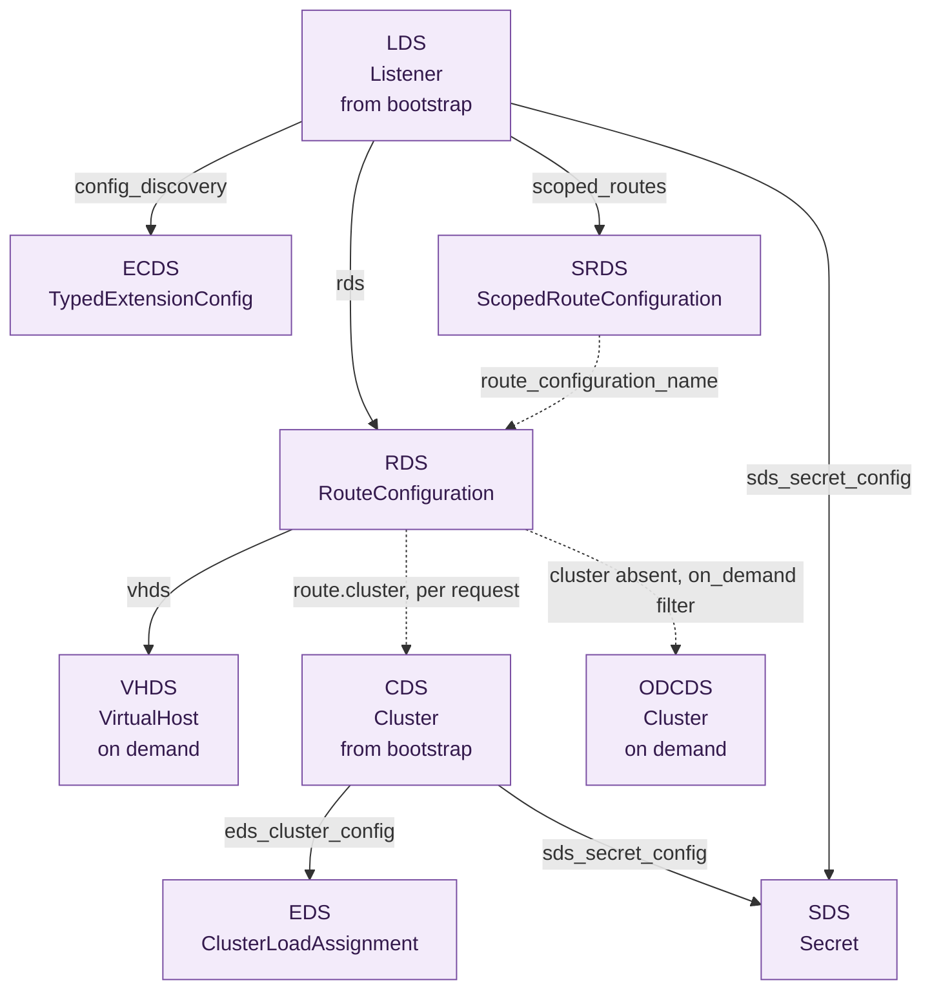
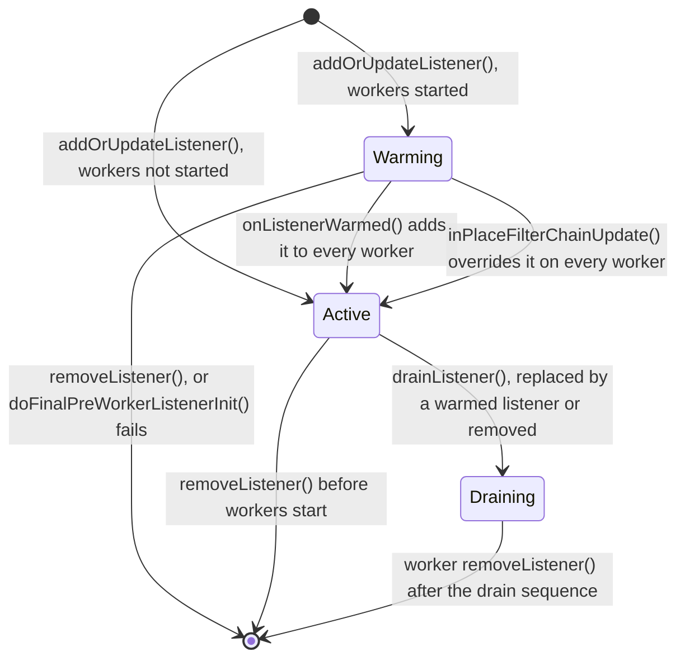
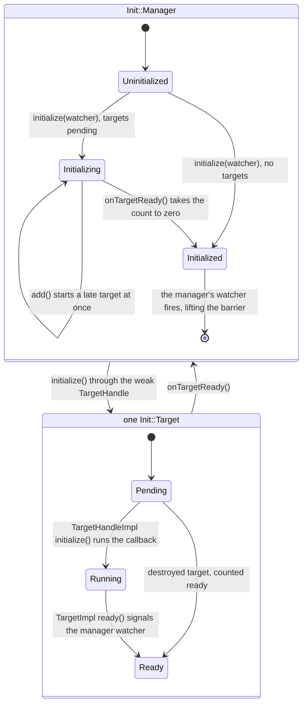

# 2. Configuration and xDS

*How does a protobuf — on disk or on a gRPC stream — become the objects a worker
thread executes against, without dropping a connection on the way?*

Envoy has essentially no compiled-in policy. Which ports it listens on, which upstreams it knows about, which filters run on a request, which certificates it presents — all of it arrives as data. That data is protobuf, and there are exactly two ways in: a bootstrap file read once at startup, and long-lived subscriptions to a management server that can rewrite most of the configuration while the process keeps serving traffic. This chapter follows configuration from the file on disk, through the subscription machinery, into the objects workers execute against.

## Configuration is a proto, not a file format

The root message is `Bootstrap`, defined in [`api/envoy/config/bootstrap/v3/bootstrap.proto`](https://github.com/envoyproxy/envoy/blob/981d3923fed302ab44ee9fd265fb078d4aabbd85/api/envoy/config/bootstrap/v3/bootstrap.proto). Envoy never parses YAML into an ad-hoc structure; it parses YAML (or JSON, or text-format protobuf) into that message and works with the message. [`InstanceUtil::loadBootstrapConfig`](https://github.com/envoyproxy/envoy/blob/981d3923fed302ab44ee9fd265fb078d4aabbd85/source/server/server.cc#L364) merges up to three sources — `--config-path`, `--config-yaml`, and an in-process `Options::configProto()` — into one `Bootstrap`, then validates it.

Two things make protobuf-as-config more than a serialization choice. Validation is declarative: field constraints are protoc-gen-validate annotations on the message, checked by `MessageUtil::validate` in [`source/common/protobuf/utility.h`](https://github.com/envoyproxy/envoy/blob/981d3923fed302ab44ee9fd265fb078d4aabbd85/source/common/protobuf/utility.h#L228), so a malformed listener is rejected before any object is constructed. And every parse is mediated by a [`ProtobufMessage::ValidationVisitor`](https://github.com/envoyproxy/envoy/blob/981d3923fed302ab44ee9fd265fb078d4aabbd85/envoy/protobuf/message_validator.h#L20) that decides what to do about unknown and deprecated fields. Envoy keeps two: a strict visitor for static bootstrap, where a typo should abort startup, and a lenient one for dynamic config, where rejecting an update because the control plane sent a field this binary does not know about is worse than ignoring it. Extension configuration is carried as `google.protobuf.Any` and resolved to a factory by type URL (see [Chapter 3](./03-extension-framework.md)).

## The static half

`Bootstrap.static_resources` holds three repeated fields — listeners, clusters, and secrets — plus `dynamic_resources`, which names the config sources for the rest. [`MainImpl::initialize`](https://github.com/envoyproxy/envoy/blob/981d3923fed302ab44ee9fd265fb078d4aabbd85/source/server/configuration_impl.cc#L112) walks the static half in a deliberate order: tracing first (so static listeners see it), then stats configuration, then static secrets into the secret manager, then the cluster manager, then listeners one at a time via `addOrUpdateListener`, then watchdogs and stats sinks. Admin, runtime layers and flags are pulled out earlier by [`InitialImpl`](https://github.com/envoyproxy/envoy/blob/981d3923fed302ab44ee9fd265fb078d4aabbd85/source/server/configuration_impl.h#L192), because the admin server must exist before most of this runs.

Clusters come before listeners for a concrete reason: the gRPC or REST subscriptions used for dynamic config are themselves ordinary Envoy upstream connections. The cluster that talks to the management server must already exist statically before anything can subscribe to anything, which is why [`Utility::checkApiConfigSourceSubscriptionBackingCluster`](https://github.com/envoyproxy/envoy/blob/981d3923fed302ab44ee9fd265fb078d4aabbd85/source/common/config/utility.cc#L136) rejects a config source whose backing cluster is not among the primary clusters.

## Five acronyms, one interface

The dynamic half is conventionally described as a family of discovery services — LDS for listeners, CDS for clusters, RDS for route tables, EDS for endpoints, SDS for secrets — but in the code they are the same thing five times over: a resource type URL plus a subsystem-specific object that implements [`Config::SubscriptionCallbacks`](https://github.com/envoyproxy/envoy/blob/981d3923fed302ab44ee9fd265fb078d4aabbd85/envoy/config/subscription.h#L97) and owns a [`Config::Subscription`](https://github.com/envoyproxy/envoy/blob/981d3923fed302ab44ee9fd265fb078d4aabbd85/envoy/config/subscription.h#L240). LDS is [`LdsApiImpl`](https://github.com/envoyproxy/envoy/blob/981d3923fed302ab44ee9fd265fb078d4aabbd85/source/common/listener_manager/lds_api.h#L25), CDS is [`CdsApiImpl`](https://github.com/envoyproxy/envoy/blob/981d3923fed302ab44ee9fd265fb078d4aabbd85/source/common/upstream/cds_api_impl.h#L35), SDS is [`SdsApi`](https://github.com/envoyproxy/envoy/blob/981d3923fed302ab44ee9fd265fb078d4aabbd85/source/common/secret/sds_api.h#L49), EDS is folded into [`EdsClusterImpl`](https://github.com/envoyproxy/envoy/blob/981d3923fed302ab44ee9fd265fb078d4aabbd85/source/extensions/clusters/eds/eds.h#L31), and RDS lives in [`RdsRouteConfigSubscription`](https://github.com/envoyproxy/envoy/blob/981d3923fed302ab44ee9fd265fb078d4aabbd85/source/common/rds/rds_route_config_subscription.h#L42) (see [Chapter 7](./07-routing.md)).

The callback interface has two shapes, and the split is the state-of-the-world versus delta distinction:

```c++
  virtual absl::Status onConfigUpdate(const std::vector<DecodedResourceRef>& resources,
                                      const std::string& version_info) PURE;
```
```c++
  virtual absl::Status
  onConfigUpdate(const std::vector<DecodedResourceRef>& added_resources,
                 const Protobuf::RepeatedPtrField<std::string>& removed_resources,
                 const std::string& system_version_info) PURE;
```

A state-of-the-world update carries the complete set of resources of that type; anything absent is implicitly deleted. That is why [`CdsApiImpl::onConfigUpdate`](https://github.com/envoyproxy/envoy/blob/981d3923fed302ab44ee9fd265fb078d4aabbd85/source/common/upstream/cds_api_impl.cc#L51) begins by diffing the incoming names against the clusters the manager currently holds, synthesising a removal list, and delegating to the delta-shaped overload; LDS does the same. Resources arrive already deserialized, as [`DecodedResource`](https://github.com/envoyproxy/envoy/blob/981d3923fed302ab44ee9fd265fb078d4aabbd85/envoy/config/subscription.h#L32) objects produced by a per-type [`OpaqueResourceDecoder`](https://github.com/envoyproxy/envoy/blob/981d3923fed302ab44ee9fd265fb078d4aabbd85/envoy/config/subscription.h#L73) that knows how to pull the name out of the message.

## Four more, and one on demand

The same shape repeats for four services the list above leaves out, and the useful question for each is which object owns the subscription. RTDS delivers runtime layers: one [`RtdsSubscription`](https://github.com/envoyproxy/envoy/blob/981d3923fed302ab44ee9fd265fb078d4aabbd85/source/common/runtime/runtime_impl.h#L175) per `rtds_layer` in the bootstrap, owned by the runtime loader, so feature flags move without touching listeners. SRDS delivers scoped route tables and is owned by [`ScopedRdsConfigSubscription`](https://github.com/envoyproxy/envoy/blob/981d3923fed302ab44ee9fd265fb078d4aabbd85/source/common/router/scoped_rds.h#L109). VHDS delivers individual virtual hosts on demand, for route tables too large to ship whole; its [`VhdsSubscription`](https://github.com/envoyproxy/envoy/blob/981d3923fed302ab44ee9fd265fb078d4aabbd85/source/common/router/vhds.h#L39) hangs off the RDS subscription that owns the route config (see [Chapter 7](./07-routing.md)). Of those two, only SRDS sits on the generic provider framework in [`config_provider_impl.h`](https://github.com/envoyproxy/envoy/blob/981d3923fed302ab44ee9fd265fb078d4aabbd85/source/common/config/config_provider_impl.h), whose [`ConfigSubscriptionCommonBase`](https://github.com/envoyproxy/envoy/blob/981d3923fed302ab44ee9fd265fb078d4aabbd85/source/common/config/config_provider_impl.h#L143) holds the thread-local slot workers read; RDS and VHDS use the separate provider machinery under `source/common/rds/`.

ECDS is the one that answers a question the extension framework raises directly: can a filter's configuration change without an LDS update? A filter entry carries `config_discovery` — an `ExtensionConfigSource` — instead of `typed_config`, and [`FilterChainHelper::processDynamicFilterConfig`](https://github.com/envoyproxy/envoy/blob/981d3923fed302ab44ee9fd265fb078d4aabbd85/source/common/http/filter_chain_helper.h#L130) pushes a *dynamic* config provider onto the filter list where a static filter would have contributed a provider wrapping an already-resolved factory callback (see [Chapter 3](./03-extension-framework.md)). The resource type is `TypedExtensionConfig`, and one [`FilterConfigSubscription`](https://github.com/envoyproxy/envoy/blob/981d3923fed302ab44ee9fd265fb078d4aabbd85/source/common/filter/config_discovery_impl.h#L421) per config-source-and-name pair — the map key is a hash of the config source plus the filter name — is shared by every filter chain that names it. Each user holds a [`DynamicFilterConfigProviderImpl`](https://github.com/envoyproxy/envoy/blob/981d3923fed302ab44ee9fd265fb078d4aabbd85/source/common/filter/config_discovery_impl.h#L70) whose `config()` reads a thread-local `std::optional<FactoryCb>`, republished to every worker on update. Because [`FilterChainUtility::createFilterChainForFactories`](https://github.com/envoyproxy/envoy/blob/981d3923fed302ab44ee9fd265fb078d4aabbd85/source/common/http/filter_chain_helper.cc#L18) asks the provider for its callback each time it builds a chain, no listener is drained: the next stream gets the new filter, and a provider with no config yet contributes a stub filter that returns 500. `type_urls` bounds what the control plane may send; `default_config` is what the provider serves before a response arrives, and `apply_default_config_without_warming` decides whether the listener waits for one.

On-demand delivery inverts the flow: [`OdCdsApiImpl::updateOnDemand`](https://github.com/envoyproxy/envoy/blob/981d3923fed302ab44ee9fd265fb078d4aabbd85/source/common/upstream/od_cds_api_impl.cc#L104) asks for a single cluster by name when a route needs one the manager does not have, which works only over delta.


*Figure 2.1 — Which resource pulls in which. Only LDS and CDS name a config
source in `dynamic_resources`; every other subscription is opened by a resource
already accepted. A solid edge is a config source embedded in the parent
resource, so accepting the parent opens the child's subscription; a dotted edge
is a bare name resolved later, at the next scope update or at request time.
Source:
[`HttpConnectionManagerConfig`](https://github.com/envoyproxy/envoy/blob/981d3923fed302ab44ee9fd265fb078d4aabbd85/source/extensions/filters/network/http_connection_manager/config.cc#L55),
[`FilterConfigSubscription::start`](https://github.com/envoyproxy/envoy/blob/981d3923fed302ab44ee9fd265fb078d4aabbd85/source/common/filter/config_discovery_impl.cc#L102),
[`SecretManagerImpl::findOrCreateTlsCertificateProvider`](https://github.com/envoyproxy/envoy/blob/981d3923fed302ab44ee9fd265fb078d4aabbd85/source/common/secret/secret_manager_impl.cc#L130),
[`EdsClusterImpl`](https://github.com/envoyproxy/envoy/blob/981d3923fed302ab44ee9fd265fb078d4aabbd85/source/extensions/clusters/eds/eds.cc#L28),
[`OdCdsApiImpl::updateOnDemand`](https://github.com/envoyproxy/envoy/blob/981d3923fed302ab44ee9fd265fb078d4aabbd85/source/common/upstream/od_cds_api_impl.cc#L104).*

## Choosing a transport

A subsystem does not choose its transport. It hands a `ConfigSource` proto to [`SubscriptionFactoryImpl::subscriptionFromConfigSource`](https://github.com/envoyproxy/envoy/blob/981d3923fed302ab44ee9fd265fb078d4aabbd85/source/common/config/subscription_factory_impl.cc#L27), which switches on the oneof and maps it to a registered extension name — `envoy.config_subscription.filesystem`, `.rest`, `.grpc`, `.delta_grpc` or `.ads` — then looks that name up in the [`ConfigSubscriptionFactory`](https://github.com/envoyproxy/envoy/blob/981d3923fed302ab44ee9fd265fb078d4aabbd85/envoy/config/subscription_factory.h#L110) registry and calls `create`. Transports are extensions like everything else.

Two of these are trivial. [`FilesystemSubscriptionImpl::refresh`](https://github.com/envoyproxy/envoy/blob/981d3923fed302ab44ee9fd265fb078d4aabbd85/source/extensions/config_subscription/filesystem/filesystem_subscription_impl.cc#L83) reparses a watched file as a `DiscoveryResponse` on every change and calls the state-of-the-world callback; [`HttpSubscriptionImpl::createRequest`](https://github.com/envoyproxy/envoy/blob/981d3923fed302ab44ee9fd265fb078d4aabbd85/source/extensions/config_subscription/rest/http_subscription_impl.cc#L71) POSTs a JSON-encoded `DiscoveryRequest` on a jittered timer. Production deployments use gRPC.

## The gRPC mux

gRPC is different because one bidirectional stream can serve many subscriptions. That is what a *mux* is. [`GrpcSubscriptionImpl`](https://github.com/envoyproxy/envoy/blob/981d3923fed302ab44ee9fd265fb078d4aabbd85/source/extensions/config_subscription/grpc/grpc_subscription_impl.h#L20) is a thin adapter: [`GrpcSubscriptionImpl::start`](https://github.com/envoyproxy/envoy/blob/981d3923fed302ab44ee9fd265fb078d4aabbd85/source/extensions/config_subscription/grpc/grpc_subscription_impl.cc#L32) arms an initial-fetch-timeout timer and registers a watch on a [`GrpcMux`](https://github.com/envoyproxy/envoy/blob/981d3923fed302ab44ee9fd265fb078d4aabbd85/envoy/config/grpc_mux.h#L60); streams, retries and ACKs all live in the mux. The stream itself is opened with the gRPC async client, which is what makes the "ordinary upstream connection" claim above literally true (see [Chapter 14](./14-async-client.md)).

The state-of-the-world mux is [`GrpcMuxImpl`](https://github.com/envoyproxy/envoy/blob/981d3923fed302ab44ee9fd265fb078d4aabbd85/source/extensions/config_subscription/grpc/grpc_mux_impl.h#L40), which keeps a per-type-URL `ApiState` holding the watches and the current `DiscoveryRequest`, whose `version_info` field is the last accepted version. [`GrpcMuxImpl::sendDiscoveryRequest`](https://github.com/envoyproxy/envoy/blob/981d3923fed302ab44ee9fd265fb078d4aabbd85/source/extensions/config_subscription/grpc/grpc_mux_impl.cc#L172) rebuilds `resource_names` as the union of all watches for that type. [`GrpcMuxImpl::onDiscoveryResponse`](https://github.com/envoyproxy/envoy/blob/981d3923fed302ab44ee9fd265fb078d4aabbd85/source/extensions/config_subscription/grpc/grpc_mux_impl.cc#L363) decodes the resources, dispatches them to the watches, and — this is the ACK — copies the response's `version_info` into the stored request so the next request echoes it. A rejected update leaves `version_info` alone and attaches an `error_detail`: that is a NACK. The nonce says which response is being answered.

Delta is implemented by [`NewGrpcMuxImpl`](https://github.com/envoyproxy/envoy/blob/981d3923fed302ab44ee9fd265fb078d4aabbd85/source/extensions/config_subscription/grpc/new_grpc_mux_impl.h#L32) over [`DeltaSubscriptionState`](https://github.com/envoyproxy/envoy/blob/981d3923fed302ab44ee9fd265fb078d4aabbd85/source/extensions/config_subscription/grpc/delta_subscription_state.h#L77), which tracks a version per resource rather than per type and has to model the awkward corner where a resource has been explicitly unsubscribed but might still be covered by a wildcard subscription — the "ambiguous" category. A second, unified generation of both muxes lives under `xds_mux/`, selected by the `envoy.reloadable_features.unified_mux` runtime guard (false by default), exposing [`GrpcMuxSotw`](https://github.com/envoyproxy/envoy/blob/981d3923fed302ab44ee9fd265fb078d4aabbd85/source/extensions/config_subscription/grpc/xds_mux/grpc_mux_impl.h#L277) and [`GrpcMuxDelta`](https://github.com/envoyproxy/envoy/blob/981d3923fed302ab44ee9fd265fb078d4aabbd85/source/extensions/config_subscription/grpc/xds_mux/grpc_mux_impl.h#L261). Where several independent subscribers want the same resource, [`WatchMap`](https://github.com/envoyproxy/envoy/blob/981d3923fed302ab44ee9fd265fb078d4aabbd85/source/extensions/config_subscription/grpc/watch_map.h#L73) fans one wire subscription out to many callbacks and computes which names were genuinely added to or removed from the aggregate as interest changes.

## ADS and ordering

ADS is not a sixth discovery service; it is the instruction to put all of them on one stream. [`XdsManagerImpl::initializeAdsConnections`](https://github.com/envoyproxy/envoy/blob/981d3923fed302ab44ee9fd265fb078d4aabbd85/source/common/config/xds_manager_impl.cc#L171) builds one mux from `dynamic_resources.ads_config` — the single point where delta and SotW are distinguished, after which everything holds a `GrpcMux` interface. Subscriptions with `ads` in their `ConfigSource` route to `AdsConfigSubscriptionFactory`, which just wraps that shared mux in a `GrpcSubscriptionImpl` constructed with `is_aggregated` true. Such a subscription's `start()` registers its watch but deliberately does *not* call the mux's `start()`; the cluster manager opens the ADS stream itself, once the cluster backing it has initialized (or during its own initialization if no cluster backs it), so the initial requests of every subsystem that registered a watch in the meantime are batched.

Ordering matters because the resources form a dependency graph: a route referencing a cluster that does not yet exist produces 503s. Envoy cannot force a management server to sequence correctly, but it signals readiness by withholding ACKs. [`GrpcMux::pause`](https://github.com/envoyproxy/envoy/blob/981d3923fed302ab44ee9fd265fb078d4aabbd85/envoy/config/grpc_mux.h#L79) returns a `ScopedResume` that suppresses requests for a type URL until destroyed. [`LdsApiImpl::onConfigUpdate`](https://github.com/envoyproxy/envoy/blob/981d3923fed302ab44ee9fd265fb078d4aabbd85/source/common/listener_manager/lds_api.cc#L50) pauses RDS, SRDS and SDS while applying a batch of listeners, so the new listeners' route and secret subscriptions all register before one request goes out. [`ClusterManagerImpl::updateClusterCounts`](https://github.com/envoyproxy/envoy/blob/981d3923fed302ab44ee9fd265fb078d4aabbd85/source/common/upstream/cluster_manager_impl.cc#L959) holds CDS paused as long as any cluster is warming, so the CDS ACK doubles as "the clusters you sent are usable, you may send routes."

## Warming, and the init framework

Applying config is rarely instantaneous. A new cluster may need a DNS resolution or an EDS response; a new listener may need an SDS secret before its TLS context is valid. Envoy's answer is a small dependency-tracking library in [`source/common/init/`](https://github.com/envoyproxy/envoy/blob/981d3923fed302ab44ee9fd265fb078d4aabbd85/source/common/init/manager_impl.h). An [`Init::Target`](https://github.com/envoyproxy/envoy/blob/981d3923fed302ab44ee9fd265fb078d4aabbd85/envoy/init/target.h#L41) must finish before its owner is usable; an [`Init::Manager`](https://github.com/envoyproxy/envoy/blob/981d3923fed302ab44ee9fd265fb078d4aabbd85/envoy/init/manager.h#L36) collects targets and fires an [`Init::Watcher`](https://github.com/envoyproxy/envoy/blob/981d3923fed302ab44ee9fd265fb078d4aabbd85/envoy/init/watcher.h) when the last reports ready. [`ManagerImpl::add`](https://github.com/envoyproxy/envoy/blob/981d3923fed302ab44ee9fd265fb078d4aabbd85/source/common/init/manager_impl.cc#L17) either stores the target or, if initialization is already in flight, starts it immediately; [`ManagerImpl::onTargetReady`](https://github.com/envoyproxy/envoy/blob/981d3923fed302ab44ee9fd265fb078d4aabbd85/source/common/init/manager_impl.cc#L80) decrements a count and signals the watcher at zero.

The interface is built around lifetime. Targets and watchers are reachable only through [`TargetHandle`](https://github.com/envoyproxy/envoy/blob/981d3923fed302ab44ee9fd265fb078d4aabbd85/envoy/init/target.h#L19) and `WatcherHandle`, weak references for which telling a destroyed target to initialize is a no-op rather than a use-after-free. Managers nest: a listener's targets register with the listener's own manager, whose completion is itself a target of the server's. LDS's target shows the pattern in miniature:

```c++
      init_target_("LDS", [this]() { subscription_->start({}); }) {
```

The subscription does not start when the object is built; it starts when the server's init manager reaches it, and `init_target_.ready()` is called from `onConfigUpdate` — or from `onConfigUpdateFailed`, so a broken control plane delays startup by the fetch timeout rather than forever.

Startup is a chain of these, and it is what the worker-start sequencing in [Chapter 1](./01-process-model.md) is waiting on. [`RunHelper`](https://github.com/envoyproxy/envoy/blob/981d3923fed302ab44ee9fd265fb078d4aabbd85/source/server/server.h#L162) registers a callback with the cluster manager; when [`ClusterManagerInitHelper`](https://github.com/envoyproxy/envoy/blob/981d3923fed302ab44ee9fd265fb078d4aabbd85/source/common/upstream/cluster_manager_impl.h#L131) has walked its states — primary clusters, then secondary clusters, then the first CDS response, then the clusters that response created — it calls back, and only then does `RunHelper` call `init_manager.initialize(init_watcher_)`, whose completion runs the post-init callback that starts workers. It pauses RDS across that call, for the same reason LDS does.

## Warming a listener

Listener warming reuses the same machinery, with a twist that depends on whether workers are running. Each [`ListenerImpl`](https://github.com/envoyproxy/envoy/blob/981d3923fed302ab44ee9fd265fb078d4aabbd85/source/common/listener_manager/listener_impl.h#L208) — the main-thread object that also owns the listen sockets and the filter chain manager, both of which are [Chapter 4](./04-accept-path.md)'s subject — owns a `dynamic_init_manager_` plus two hooks: a `listener_init_target_` registered with the *server's* init manager, and a `local_init_watcher_` fired when the listener's own targets complete.

[`ListenerManagerImpl::addOrUpdateListenerInternal`](https://github.com/envoyproxy/envoy/blob/981d3923fed302ab44ee9fd265fb078d4aabbd85/source/common/listener_manager/listener_manager_impl.cc#L594) hashes the config, short-circuits if it is unchanged, and puts the new listener in `warming_listeners_` if workers are running and `active_listeners_` if not. When warming finishes, [`ListenerManagerImpl::onListenerWarmed`](https://github.com/envoyproxy/envoy/blob/981d3923fed302ab44ee9fd265fb078d4aabbd85/source/common/listener_manager/listener_manager_impl.cc#L865) hands the listener to every worker, promotes it, and passes the listener it replaced to [`ListenerManagerImpl::drainListener`](https://github.com/envoyproxy/envoy/blob/981d3923fed302ab44ee9fd265fb078d4aabbd85/source/common/listener_manager/listener_manager_impl.cc#L728), which stops accepting and notifies existing connections so codecs can react before the drain timer expires. An LDS update therefore never drops a connection and never leaves a half-configured listener accepting traffic.


*Figure 2.2 — A listener's lifecycle. Before workers start it goes straight into
`active_listeners_`, driven by the server's init manager through
`listener_init_target_`; afterwards each update warms in `warming_listeners_`
first, driven by the listener's own manager. The in-place path is the exception
to the `Draining` box: the listener it replaces goes to `drainFilterChains`, so
only the chains that changed drain and the socket never stops accepting. Source:
[`ListenerManagerImpl::addOrUpdateListenerInternal`](https://github.com/envoyproxy/envoy/blob/981d3923fed302ab44ee9fd265fb078d4aabbd85/source/common/listener_manager/listener_manager_impl.cc#L594),
[`ListenerManagerImpl::onListenerWarmed`](https://github.com/envoyproxy/envoy/blob/981d3923fed302ab44ee9fd265fb078d4aabbd85/source/common/listener_manager/listener_manager_impl.cc#L865),
[`ListenerManagerImpl::inPlaceFilterChainUpdate`](https://github.com/envoyproxy/envoy/blob/981d3923fed302ab44ee9fd265fb078d4aabbd85/source/common/listener_manager/listener_manager_impl.cc#L899),
[`ListenerManagerImpl::removeListenerInternal`](https://github.com/envoyproxy/envoy/blob/981d3923fed302ab44ee9fd265fb078d4aabbd85/source/common/listener_manager/listener_manager_impl.cc#L999).*


*Figure 2.3 — The barrier a warming listener waits behind: its manager holds one
target per SDS secret, RDS subscription and dynamic filter config, and lifts only
when the last of them reports ready — or is destroyed, which counts the same.
Source:
[`ManagerImpl::initialize`](https://github.com/envoyproxy/envoy/blob/981d3923fed302ab44ee9fd265fb078d4aabbd85/source/common/init/manager_impl.cc#L40),
[`ManagerImpl::onTargetReady`](https://github.com/envoyproxy/envoy/blob/981d3923fed302ab44ee9fd265fb078d4aabbd85/source/common/init/manager_impl.cc#L80),
[`TargetHandleImpl::initialize`](https://github.com/envoyproxy/envoy/blob/981d3923fed302ab44ee9fd265fb078d4aabbd85/source/common/init/target_impl.cc#L10).*

## Getting it to the workers

Everything above happens on the main thread. Workers never read a `Bootstrap`, never see a `DiscoveryResponse`, and never take a lock to read configuration. When the cluster manager has absorbed a CDS or EDS update it calls `runOnAllThreads` on a thread-local slot, and [`InstanceImpl::runOnAllThreads`](https://github.com/envoyproxy/envoy/blob/981d3923fed302ab44ee9fd265fb078d4aabbd85/source/common/thread_local/thread_local_impl.cc#L179) posts the update to each worker's dispatcher, where it is applied inside that worker's event loop. The main thread holds the authoritative structures, each worker holds its own snapshot, and the handoff is a posted callback rather than shared mutable state. [Chapter 11](./11-event-loop-and-threading.md) covers the slots and the posting.

## Reading back what is applied

The authoritative copy of each slice of configuration is whatever the owning manager holds in memory. To make that inspectable, a subsystem registers a callback with [`ConfigTracker`](https://github.com/envoyproxy/envoy/blob/981d3923fed302ab44ee9fd265fb078d4aabbd85/envoy/server/config_tracker.h#L23) under a unique key, and the callback builds a protobuf describing its current state on demand, filtered by a name matcher:

```c++
  using Cb = std::function<ProtobufTypes::MessagePtr(const Matchers::StringMatcher&)>;
```

Registration is RAII. `add` hands back an [`EntryOwner`](https://github.com/envoyproxy/envoy/blob/981d3923fed302ab44ee9fd265fb078d4aabbd85/envoy/server/config_tracker.h#L36), and the entry leaves the map when that handle is destroyed or the tracker dies, whichever comes first — [`ConfigTrackerImpl`](https://github.com/envoyproxy/envoy/blob/981d3923fed302ab44ee9fd265fb078d4aabbd85/source/server/admin/config_tracker_impl.h#L14) keeps the map behind a `shared_ptr` so an owner outliving the tracker is still safe. The server registers `bootstrap` itself via [`InstanceBase::dumpBootstrapConfig`](https://github.com/envoyproxy/envoy/blob/981d3923fed302ab44ee9fd265fb078d4aabbd85/source/server/server.cc#L1216); [`ClusterManagerImpl::dumpClusterConfigs`](https://github.com/envoyproxy/envoy/blob/981d3923fed302ab44ee9fd265fb078d4aabbd85/source/common/upstream/cluster_manager_impl.cc#L1732) and [`ListenerManagerImpl::dumpListenerConfigs`](https://github.com/envoyproxy/envoy/blob/981d3923fed302ab44ee9fd265fb078d4aabbd85/source/common/listener_manager/listener_manager_impl.cc#L437) add theirs, the generic provider framework registers one key per manager instance from the [`ConfigProviderManagerImplBase`](https://github.com/envoyproxy/envoy/blob/981d3923fed302ab44ee9fd265fb078d4aabbd85/source/common/config/config_provider_impl.h#L364) constructor (`route_scopes`, for scoped routes), and ECDS registers one per filter category — `ecds_filter_http`, `ecds_filter_network` and the rest — from [`FilterConfigProviderManagerImplBase`](https://github.com/envoyproxy/envoy/blob/981d3923fed302ab44ee9fd265fb078d4aabbd85/source/common/filter/config_discovery_impl.h#L525). The cluster dump splits static from dynamic-active and dynamic-warming, and every dynamic entry carries the version info and timestamp its subscription recorded. The admin endpoint that walks the map and concatenates the results is [Chapter 13](./13-observability-and-operations.md)'s subject.
