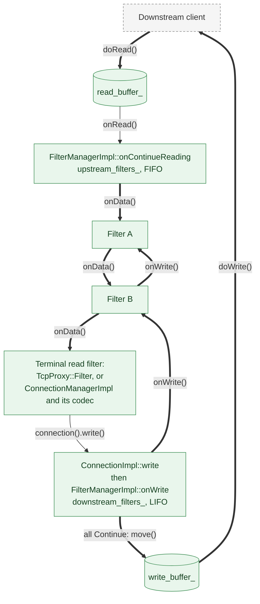
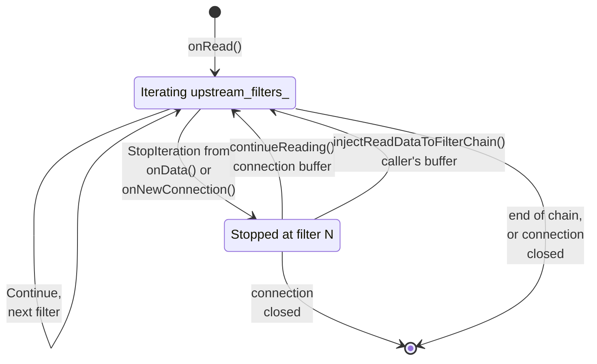

# 5. Network Filters and the HTTP Codecs

*How does a structureless stream of bytes on a connection become a sequence of HTTP
messages, and what can run in between?*

A worker thread has accepted a socket, run the listener filters, matched a filter chain and built
a `Network::Connection` (see [Chapter 4](./04-accept-path.md)). All it has from that point on is a structureless stream of
bytes, while everything else Envoy does — routing, retries, rate limiting, tracing — is defined
over *messages*. Two mechanisms bridge the gap: an L4 filter chain that lets arbitrary code
transform the byte stream, and a codec that turns bytes into HTTP objects for the one filter that
cares.

## From socket bytes to the filter chain

Every connection owns a read buffer. When the event loop reports the socket readable,
[`ConnectionImpl::onReadReady`](https://github.com/envoyproxy/envoy/blob/981d3923fed302ab44ee9fd265fb078d4aabbd85/source/common/network/connection_impl.cc#L765)
asks the transport socket to `doRead` into that buffer and then calls `onRead`, which — after
checking that the connection is not delay-closing and still wants data — hands control to the
filter manager.

The filter contract is deliberately thin.
[`ReadFilter`](https://github.com/envoyproxy/envoy/blob/981d3923fed302ab44ee9fd265fb078d4aabbd85/envoy/network/filter.h#L254) has three pure virtual methods:
`initializeReadFilterCallbacks`, `onNewConnection`, and `onData(Buffer::Instance& data, bool
end_stream)`. The mirror image, [`WriteFilter`](https://github.com/envoyproxy/envoy/blob/981d3923fed302ab44ee9fd265fb078d4aabbd85/envoy/network/filter.h#L136), has
`onWrite`. Both return a `FilterStatus` that is either `Continue` or `StopIteration` — there is no
third value at L4. Crucially, `data` is not a copy handed to the filter; it is the connection's own
read buffer, and filters consume bytes by draining it. Per
[`FilterManager`](https://github.com/envoyproxy/envoy/blob/981d3923fed302ab44ee9fd265fb078d4aabbd85/envoy/network/filter.h#L308), the two orders are mirror
images, so a filter that wraps the wire format occupies the same position on both paths.


*Figure 5.1 — One connection, two chains. Neither filter calls the next: both loops live in the
filter manager, which re-fetches the buffer between filters and runs read filters in registration
order and write filters in reverse — `addReadFilter` appends to `upstream_filters_` while
`addWriteFilter` prepends to `downstream_filters_`, and both loops walk from `begin()`. So
combination `Filter`s — A and B here, registered with `addFilter` — sit at mirrored positions. The
write filters see the caller's buffer; only once the last returns `Continue` does the connection
move it into `write_buffer_`. Source:
[`FilterManagerImpl::onContinueReading`](https://github.com/envoyproxy/envoy/blob/981d3923fed302ab44ee9fd265fb078d4aabbd85/source/common/network/filter_manager_impl.cc#L62),
[`addReadFilter`](https://github.com/envoyproxy/envoy/blob/981d3923fed302ab44ee9fd265fb078d4aabbd85/source/common/network/filter_manager_impl.cc#L25),
[`addWriteFilter`](https://github.com/envoyproxy/envoy/blob/981d3923fed302ab44ee9fd265fb078d4aabbd85/source/common/network/filter_manager_impl.cc#L13),
[`FilterManagerImpl::onWrite`](https://github.com/envoyproxy/envoy/blob/981d3923fed302ab44ee9fd265fb078d4aabbd85/source/common/network/filter_manager_impl.cc#L180),
[`ConnectionImpl::write`](https://github.com/envoyproxy/envoy/blob/981d3923fed302ab44ee9fd265fb078d4aabbd85/source/common/network/connection_impl.cc#L590),
[`TcpProxy::Filter::onUpstreamData`](https://github.com/envoyproxy/envoy/blob/981d3923fed302ab44ee9fd265fb078d4aabbd85/source/common/tcp_proxy/tcp_proxy.cc#L1275).*

The loop lives in
[`FilterManagerImpl::onContinueReading`](https://github.com/envoyproxy/envoy/blob/981d3923fed302ab44ee9fd265fb078d4aabbd85/source/common/network/filter_manager_impl.cc#L62),
and its shape explains most of the observable behaviour:

```cpp
    StreamBuffer read_buffer = buffer_source.getReadBuffer();
    if (read_buffer.buffer.length() > 0 || read_buffer.end_stream) {
      FilterStatus status = (*entry)->filter_->onData(read_buffer.buffer, read_buffer.end_stream);
      if (status == FilterStatus::StopIteration || connection_.state() != Connection::State::Open) {
        return;
      }
    }
```

The buffer is re-fetched on every iteration, so if a filter drains everything the next filter is
skipped entirely unless `end_stream` is set. The connection-state check matters too: a filter may
close the connection from inside `onData`, and the loop must not touch a dead object afterwards.
`onNewConnection` is dispatched from the same loop under a per-filter `initialized_` flag, so a
filter first reached long after the connection opened still sees it before any `onData`.

## Stopping and resuming

`StopIteration` is how an L4 filter buys time — to consult an authorization service, to wait for
enough bytes to sniff a protocol, to establish an upstream connection. Resumption is explicit:
nothing re-enters the chain until the stopped filter says so.
[`ReadFilterCallbacks::continueReading`](https://github.com/envoyproxy/envoy/blob/981d3923fed302ab44ee9fd265fb078d4aabbd85/envoy/network/filter.h#L176) passes the
connection itself as the buffer source, so the resumed filter sees whatever accumulated meanwhile;
a filter that wants to control exactly what its successors see calls `injectReadDataToFilterChain`
instead, which wraps the caller's own buffer in a `FixedReadBufferSource`.


*Figure 5.2 — The two L4 statuses on the read path. `StopIteration` simply returns from
`onContinueReading`, and either callback restarts the loop at `std::next(filter->entry())` — filter
N+1, never N again, which is why a filter that stopped during `onNewConnection` does not see that
buffer itself. Once the connection is closed both callbacks are no-ops: `onContinueReading` returns
at its first line. The write path uses the same enum, resumed by `injectWriteDataToFilterChain`.
Source:
[`FilterStatus`](https://github.com/envoyproxy/envoy/blob/981d3923fed302ab44ee9fd265fb078d4aabbd85/envoy/network/filter.h#L42),
[`FilterManagerImpl::onContinueReading`](https://github.com/envoyproxy/envoy/blob/981d3923fed302ab44ee9fd265fb078d4aabbd85/source/common/network/filter_manager_impl.cc#L62),
[`ActiveReadFilter::continueReading`](https://github.com/envoyproxy/envoy/blob/981d3923fed302ab44ee9fd265fb078d4aabbd85/source/common/network/filter_manager_impl.h#L154),
[`FixedReadBufferSource`](https://github.com/envoyproxy/envoy/blob/981d3923fed302ab44ee9fd265fb078d4aabbd85/source/common/network/filter_manager_impl.h#L50).*

## tcp_proxy: where L4 ends

The canonical terminal read filter is `TcpProxy::Filter`. Its
[`onNewConnection`](https://github.com/envoyproxy/envoy/blob/981d3923fed302ab44ee9fd265fb078d4aabbd85/source/common/tcp_proxy/tcp_proxy.cc#L1141) arms its
timers (connection duration, access-log flush, idle), picks a route, and — in the default
`IMMEDIATE` connect mode — calls `establishUpstreamConnection`, returning `StopIteration` whenever
the upstream is not yet available.
[`Filter::onData`](https://github.com/envoyproxy/envoy/blob/981d3923fed302ab44ee9fd265fb078d4aabbd85/source/common/tcp_proxy/tcp_proxy.cc#L1077) hands the whole buffer
to the upstream with `encodeData`, or buffers it as early data and read-disables downstream at the
configured limit. It ends with `ASSERT(0 == data.length())` and an unconditional
`return Network::FilterStatus::StopIteration`: a terminal filter consumes the byte stream, and
nothing follows it.

## The connection manager as a network filter

[`ConnectionManagerImpl`](https://github.com/envoyproxy/envoy/blob/981d3923fed302ab44ee9fd265fb078d4aabbd85/source/common/http/conn_manager_impl.h#L60) is,
structurally, just another `Network::ReadFilter`. Its factory,
[`HttpConnectionManagerFilterConfigFactory`](https://github.com/envoyproxy/envoy/blob/981d3923fed302ab44ee9fd265fb078d4aabbd85/source/extensions/filters/network/http_connection_manager/config.h#L54),
passes `true` for `is_terminal` to its base and, at connection time, does nothing more exotic than
`filter_manager.addReadFilter(std::move(hcm))`. Like tcp_proxy it consumes the stream and always
returns `StopIteration`; everything it then does with the bytes is
[Chapter 6](./06-http-connection-manager.md)'s subject.

One detail belongs here, because the rest of this chapter depends on it:
[`onData`](https://github.com/envoyproxy/envoy/blob/981d3923fed302ab44ee9fd265fb078d4aabbd85/source/common/http/conn_manager_impl.cc#L515) creates the
codec *lazily*, on the first buffer of data, rather than when the connection opens — and those
first bytes are themselves an input to codec selection.

## The codec contract

[`Http::Connection`](https://github.com/envoyproxy/envoy/blob/981d3923fed302ab44ee9fd265fb078d4aabbd85/envoy/http/codec.h#L626) is the whole downstream-facing codec
interface: `dispatch` — which returns a `Status` and drains whatever it consumed — plus `goAway`,
`protocol`, `shutdownNotice`, `wantsToWrite` and two watermark notifications.
[`ServerConnection`](https://github.com/envoyproxy/envoy/blob/981d3923fed302ab44ee9fd265fb078d4aabbd85/envoy/http/codec.h#L752) adds nothing at all; the
server-specific half of the contract lives in the callbacks the codec was constructed with:

```cpp
  virtual RequestDecoder& newStream(ResponseEncoder& response_encoder,
                                    bool is_internally_created = false) PURE;
```

That single method, on
[`ServerConnectionCallbacks`](https://github.com/envoyproxy/envoy/blob/981d3923fed302ab44ee9fd265fb078d4aabbd85/envoy/http/codec.h#L734), is where a parsed
frame becomes an Envoy stream. The codec supplies a `ResponseEncoder` and receives a
`RequestDecoder`; both are views onto one `Stream`, which carries the protocol-independent
per-stream operations — reference-counted `readDisable`, `resetStream`, `codecStreamId` — while
asynchronous events travel back through
[`StreamCallbacks`](https://github.com/envoyproxy/envoy/blob/981d3923fed302ab44ee9fd265fb078d4aabbd85/envoy/http/codec.h#L376): `onResetStream` plus the watermark
pair (see [Chapter 12](./12-buffers-and-io.md)). Decoding is a sequence of `decodeHeaders`, `decodeData`, `decodeTrailers`,
`decodeMetadata` calls, encoding the symmetric one, with nothing above the codec knowing which
wire format produced them.

### HTTP/1

[`Http1::ConnectionImpl::dispatch`](https://github.com/envoyproxy/envoy/blob/981d3923fed302ab44ee9fd265fb078d4aabbd85/source/common/http/http1/codec_impl.cc#L642)
walks the buffer one slice at a time, feeding each to `dispatchSlice`, which calls `execute` on a
[`Parser`](https://github.com/envoyproxy/envoy/blob/981d3923fed302ab44ee9fd265fb078d4aabbd85/source/common/http/http1/parser.h#L115), and draining exactly the bytes the parser
accepted. That parser is
[`BalsaParser`](https://github.com/envoyproxy/envoy/blob/981d3923fed302ab44ee9fd265fb078d4aabbd85/source/common/http/http1/balsa_parser.h#L20), which adapts QUICHE's
`BalsaFrame` to Envoy's `ParserCallbacks` by implementing `quiche::BalsaVisitorInterface`.

`onMessageBegin` is what calls `newStream`:
[`onMessageBeginBase`](https://github.com/envoyproxy/envoy/blob/981d3923fed302ab44ee9fd265fb078d4aabbd85/source/common/http/http1/codec_impl.cc#L1268)
allocates an `ActiveRequest`, obtains the decoder handle, and runs the pipelining flood check.
There is exactly one active request per connection, the defining constraint of HTTP/1:
[`onMessageCompleteBase`](https://github.com/envoyproxy/envoy/blob/981d3923fed302ab44ee9fd265fb078d4aabbd85/source/common/http/http1/codec_impl.cc#L1332)
delivers the terminal decode calls and then returns `parser_->pause()`, "so that the calling code
can process 1 request at a time and apply back pressure".

### HTTP/2

[`Http2::ConnectionImpl`](https://github.com/envoyproxy/envoy/blob/981d3923fed302ab44ee9fd265fb078d4aabbd85/source/common/http/http2/codec_impl.h#L150)
no longer talks to nghttp2 directly; it holds a `http2::adapter::Http2Adapter`, backed by nghttp2 or
by oghttp2 depending on the `use_oghttp2_codec` option or, if that is unset, the
`envoy.reloadable_features.http2_use_oghttp2` runtime flag (currently false, so nghttp2), and
receives protocol events through a nested `Http2Visitor`.
[`dispatch`](https://github.com/envoyproxy/envoy/blob/981d3923fed302ab44ee9fd265fb078d4aabbd85/source/common/http/http2/codec_impl.cc#L1093) pushes each raw
slice into `ProcessBytes`, checks the callback status after every slice, and finishes with
`sendPendingFrames`, because decoding inbound frames generates outbound ones.

Per-stream state is owned by the codec's `active_streams_` list and registered with the adapter as
stream user data, which is how a frame's stream id is resolved back to a stream:
[`ServerConnectionImpl::onBeginHeaders`](https://github.com/envoyproxy/envoy/blob/981d3923fed302ab44ee9fd265fb078d4aabbd85/source/common/http/http2/codec_impl.cc#L2504)
creates a `ServerStreamImpl` on the first HEADERS frame for an unknown id, calls
`callbacks_.newStream(*stream)`, and registers it with `SetStreamUserData`.

The codec also owns HTTP/2's own flow control, and wires it to Envoy's: DATA payload lands in the
stream's `pending_recv_data_` buffer in
[`ConnectionImpl::onData`](https://github.com/envoyproxy/envoy/blob/981d3923fed302ab44ee9fd265fb078d4aabbd85/source/common/http/http2/codec_impl.cc#L1160), which
returns window to the peer only when nothing downstream has read-disabled the stream — the
mechanism by which backpressure reaches the wire, described in Chapter 12. The initial windows come from
[`sendSettings`](https://github.com/envoyproxy/envoy/blob/981d3923fed302ab44ee9fd265fb078d4aabbd85/source/common/http/http2/codec_impl.cc#L1847).

### HTTP/3

For QUIC the codec is nearly vacuous.
[`QuicHttpConnectionImplBase::dispatch`](https://github.com/envoyproxy/envoy/blob/981d3923fed302ab44ee9fd265fb078d4aabbd85/source/common/quic/codec_impl.h#L24)
is a `PANIC("not implemented")`, with the comment that the QUIC connection already hands all data
to streams; `QuicHttpServerConnectionImpl` mostly forwards `goAway`, `shutdownNotice` and the
watermark calls onto the QUICHE session. Stream creation happens inside QUICHE: an incoming stream
becomes an
[`EnvoyQuicServerStream`](https://github.com/envoyproxy/envoy/blob/981d3923fed302ab44ee9fd265fb078d4aabbd85/source/common/quic/envoy_quic_server_stream.h#L19),
which is itself the `ResponseEncoder`, and
[`EnvoyQuicServerSession::setUpRequestDecoder`](https://github.com/envoyproxy/envoy/blob/981d3923fed302ab44ee9fd265fb078d4aabbd85/source/common/quic/envoy_quic_server_session.cc#L153)
performs the same `newStream` handshake as the other two codecs.

## Choosing a codec

[`HttpConnectionManagerConfig::createCodec`](https://github.com/envoyproxy/envoy/blob/981d3923fed302ab44ee9fd265fb078d4aabbd85/source/extensions/filters/network/http_connection_manager/config.cc#L820)
switches on the configured `codec_type`. HTTP/3 is only legal on a QUIC listener, and a QUIC
listener rejects any other codec; that branch is compiled out unless `ENVOY_ENABLE_QUIC` is
defined. `AUTO` defers to
[`ConnectionManagerUtility::autoCreateCodec`](https://github.com/envoyproxy/envoy/blob/981d3923fed302ab44ee9fd265fb078d4aabbd85/source/common/http/conn_manager_utility.cc#L88),
whose entire decision procedure is
[`determineNextProtocol`](https://github.com/envoyproxy/envoy/blob/981d3923fed302ab44ee9fd265fb078d4aabbd85/source/common/http/conn_manager_utility.cc#L71):
return the connection's ALPN result if there is one, otherwise check whether the buffered bytes
start with `CLIENT_MAGIC_PREFIX` (`"PRI * HTTP/2"`), otherwise return the empty string. Only the
exact string `h2` selects HTTP/2; everything else, including a failed sniff, falls through to
HTTP/1. Lazy codec creation pays off here: cleartext h2c prior knowledge would be undetectable if
the codec were built when the connection opened.

## Header maps and inline headers

Every codec produces a [`HeaderMap`](https://github.com/envoyproxy/envoy/blob/981d3923fed302ab44ee9fd265fb078d4aabbd85/envoy/http/header_map.h#L317): list-like, preserving
insertion order and permitting duplicate keys. Values are
[`HeaderString`](https://github.com/envoyproxy/envoy/blob/981d3923fed302ab44ee9fd265fb078d4aabbd85/envoy/http/header_map.h#L115), a variant over an
`absl::InlinedVector<char, 128>` and a plain `string_view` — the latter a *reference* to memory the
caller guarantees will outlive the map, which is how Envoy sets constant header values without
allocating or copying.

Filters and the router touch a small, known set of headers on every single request, and a hash
lookup for `:path` millions of times per second is waste. Envoy's answer is inline headers. Macro
lists in `envoy/http/header_map.h` — `INLINE_REQ_HEADERS`, `INLINE_RESP_HEADERS`,
`INLINE_REQ_RESP_HEADERS` — name the privileged headers, and `DEFINE_INLINE_HEADER` expands each
into a quartet of virtual accessors (`Path()`, `getPathValue()`, `setPath()`, `removePath()`).
[`RequestHeaderMapImpl`](https://github.com/envoyproxy/envoy/blob/981d3923fed302ab44ee9fd265fb078d4aabbd85/source/common/http/header_map_impl.h#L489) derives from
[`InlineStorage`](https://github.com/envoyproxy/envoy/blob/981d3923fed302ab44ee9fd265fb078d4aabbd85/source/common/common/utility.h#L763) and ends with a flexible array
member, `HeaderEntryImpl* inline_headers_[]`, allocated by a placement `new (inlineHeadersSize())`
so the pointer table shares the map's allocation and each accessor is a direct array index.
Extensions claim their own slot at process start via
[`CustomInlineHeaderRegistry`](https://github.com/envoyproxy/envoy/blob/981d3923fed302ab44ee9fd265fb078d4aabbd85/envoy/http/header_map.h#L615), which hands
back a `Handle` indexing the same table.

The bridge between the two worlds is
[`insertByKey`](https://github.com/envoyproxy/envoy/blob/981d3923fed302ab44ee9fd265fb078d4aabbd85/source/common/http/header_map_impl.cc#L234), called for
every header a codec adds. It performs one `staticLookup` against a
[`CompiledStringMap`](https://github.com/envoyproxy/envoy/blob/981d3923fed302ab44ee9fd265fb078d4aabbd85/source/common/common/compiled_string_map.h#L23) — keys
bucketed by length, then a trie of branch nodes ending in a single `memcmp`, no hashing — and on a
hit stores the entry pointer in the inline slot, appending with the correct delimiter if the slot
is occupied. On a miss the entry goes into the generic `HeaderList`, which builds a lazy
`flat_hash_map` index only once it reaches `kMinHeadersForLazyMap` entries, per
[`maybeMakeMap`](https://github.com/envoyproxy/envoy/blob/981d3923fed302ab44ee9fd265fb078d4aabbd85/source/common/http/header_map_impl.cc#L56).
Small maps stay a linked list; large ones get a hash index; the hot headers need neither.
