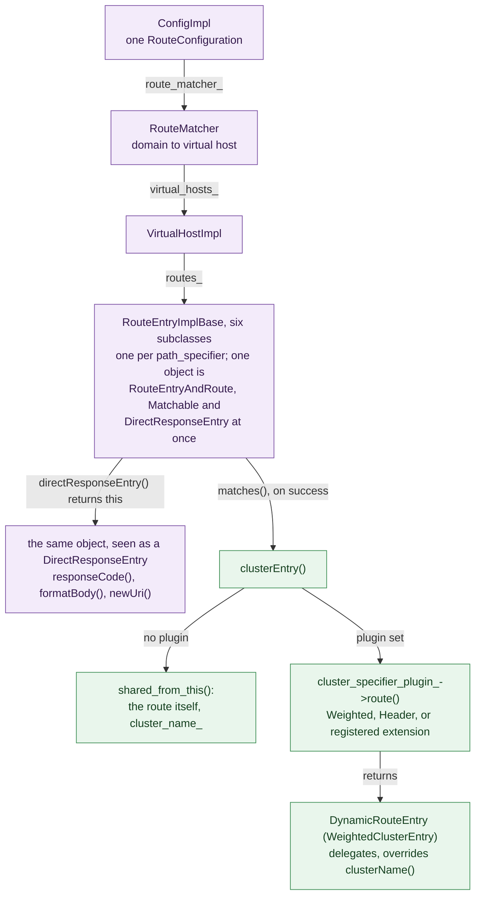
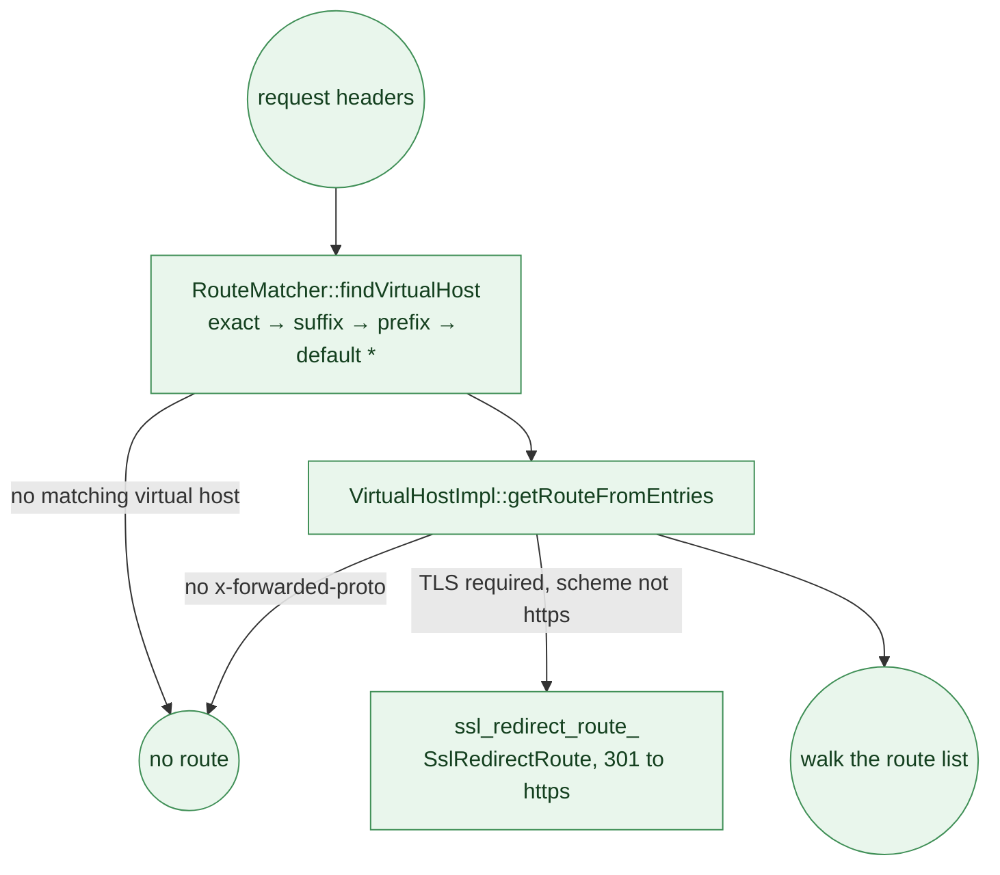
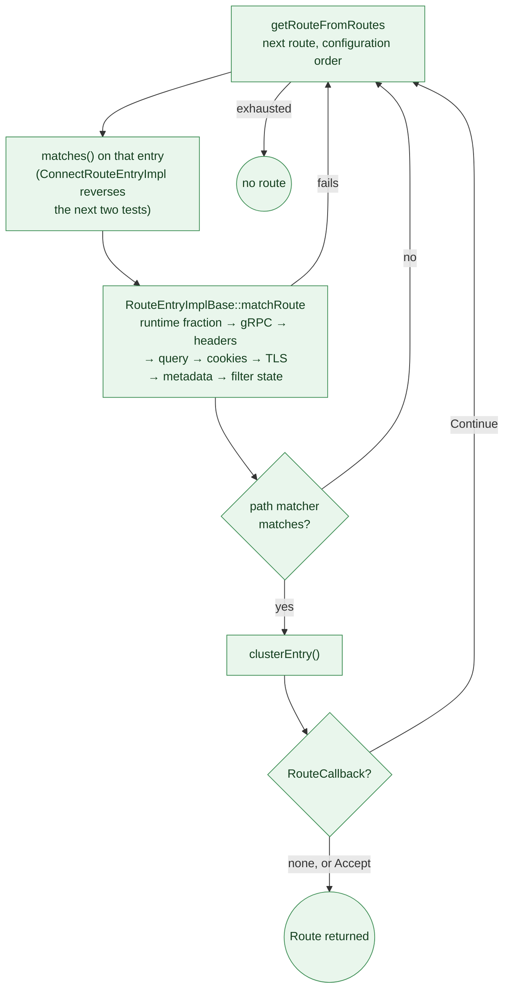

# 7. Routing: From Headers to a Cluster

*How do a request's headers select one immutable `Route`, and what else does that
route decide besides the cluster name?*

A proxy is only useful if it can decide where a request goes. In Envoy that decision is
made once per stream and produces a single immutable object — a `Route` — that every
later stage consults. The router filter reads the cluster name off it; the connection
manager reads timeouts off it; individual HTTP filters read their own per-route
configuration off it.

The route table itself is a pure function of configuration: built once when a
`RouteConfiguration` proto arrives, shared immutably across all worker threads, and
replaced wholesale on the next version. Nothing in the matching path allocates a table,
takes a lock, or mutates shared state.

## The contract the connection manager sees

Everything the HTTP connection manager knows about routing is in
[`envoy/router/router.h`](https://github.com/envoyproxy/envoy/blob/981d3923fed302ab44ee9fd265fb078d4aabbd85/envoy/router/router.h). The entry point is
[`Config`](https://github.com/envoyproxy/envoy/blob/981d3923fed302ab44ee9fd265fb078d4aabbd85/envoy/router/router.h#L1474), whose `route()` takes request headers, the
stream info and a random value, and returns a
[`VirtualHostRoute`](https://github.com/envoyproxy/envoy/blob/981d3923fed302ab44ee9fd265fb078d4aabbd85/envoy/router/router.h#L1460) — a small struct pairing
the selected virtual host with the selected route. The two are reported independently:
`RouteMatcher::route` fills in `vhost` as soon as a virtual host is found, even when no
route inside it matched.

The returned [`Route`](https://github.com/envoyproxy/envoy/blob/981d3923fed302ab44ee9fd265fb078d4aabbd85/envoy/router/router.h#L1288) is a discriminated pair: exactly
one of `directResponseEntry()` and `routeEntry()` is non-null, since
[`RouteEntryImplBase::directResponseEntry`](https://github.com/envoyproxy/envoy/blob/981d3923fed302ab44ee9fd265fb078d4aabbd85/source/common/router/config_impl.cc#L1319)
returns `this` when a direct-response code was configured and `nullptr` otherwise, and
`routeEntry()` does the reverse. A
[`RouteEntry`](https://github.com/envoyproxy/envoy/blob/981d3923fed302ab44ee9fd265fb078d4aabbd85/envoy/router/router.h#L949) names a cluster and carries the
policy bundle for proxying; a
[`DirectResponseEntry`](https://github.com/envoyproxy/envoy/blob/981d3923fed302ab44ee9fd265fb078d4aabbd85/envoy/router/router.h#L82) carries a status
code, an optional body, and a `newUri()` for redirects.

A second `route()` overload takes a callback, letting a caller inspect candidate matches
and reject them:

```cpp
using RouteCallback = std::function<RouteMatchStatus(RouteConstSharedPtr, RouteEvalStatus)>;
```

The callback receives each match in order along with a
[`RouteEvalStatus`](https://github.com/envoyproxy/envoy/blob/981d3923fed302ab44ee9fd265fb078d4aabbd85/envoy/router/router.h#L1384) saying whether more
candidates remain, and returns `Accept` or `Continue`. This is how a filter can say
"that route, but not that one" without duplicating the route table.

## Two levels: virtual host, then route

[`ConfigImpl`](https://github.com/envoyproxy/envoy/blob/981d3923fed302ab44ee9fd265fb078d4aabbd85/source/common/router/config_impl.h#L1410) delegates to
[`RouteMatcher`](https://github.com/envoyproxy/envoy/blob/981d3923fed302ab44ee9fd265fb078d4aabbd85/source/common/router/config_impl.h#L1288), which performs a
two-stage lookup.


*Figure 7.1 — The route table, from one `RouteConfiguration` down to the per-request
wrapper that names the cluster; purple is built at config time, green happens per
request. Source: [`ConfigImpl`](https://github.com/envoyproxy/envoy/blob/981d3923fed302ab44ee9fd265fb078d4aabbd85/source/common/router/config_impl.h#L1410),
[`VirtualHostImpl`](https://github.com/envoyproxy/envoy/blob/981d3923fed302ab44ee9fd265fb078d4aabbd85/source/common/router/config_impl.h#L458),
[`RouteEntryAndRoute`](https://github.com/envoyproxy/envoy/blob/981d3923fed302ab44ee9fd265fb078d4aabbd85/envoy/router/router.h#L1366),
[`RouteEntryImplBase::clusterEntry`](https://github.com/envoyproxy/envoy/blob/981d3923fed302ab44ee9fd265fb078d4aabbd85/source/common/router/config_impl.cc#L1339).*

[`RouteMatcher::findVirtualHost`](https://github.com/envoyproxy/envoy/blob/981d3923fed302ab44ee9fd265fb078d4aabbd85/source/common/router/config_impl.cc#L1995)
lower-cases the `Host` header (or an alternate header if `vhost_header` is configured,
optionally with the port stripped) and tries an exact hash lookup first, then
[`findWildcardVirtualHost`](https://github.com/envoyproxy/envoy/blob/981d3923fed302ab44ee9fd265fb078d4aabbd85/source/common/router/config_impl.cc#L1915)
over suffix wildcards, then prefix wildcards. Both wildcard maps are keyed by pattern
length in a `std::map` with `std::greater`, so iteration visits longer — more specific —
patterns first: `*-bar.baz.com` beats `*.baz.com`. Last comes the single `*` default
virtual host. The constructor rejects two `*` domains or any duplicate domain, so this
ordering is total and deterministic.

Once a virtual host is chosen,
[`VirtualHostImpl::getRouteFromEntries`](https://github.com/envoyproxy/envoy/blob/981d3923fed302ab44ee9fd265fb078d4aabbd85/source/common/router/config_impl.cc#L1856)
runs two gates before it examines any route. An absent `x-forwarded-proto` means the
connection manager already gave up on the request. A virtual host that requires TLS
short-circuits to its pre-built
[`SslRedirectRoute`](https://github.com/envoyproxy/envoy/blob/981d3923fed302ab44ee9fd265fb078d4aabbd85/source/common/router/config_impl.h#L208), a
direct-response route that emits a 301 to the `https` form of the URL.


*Figure 7.2 — Everything that can end a match before a single route entry is looked at.
Source: [`RouteMatcher::route`](https://github.com/envoyproxy/envoy/blob/981d3923fed302ab44ee9fd265fb078d4aabbd85/source/common/router/config_impl.cc#L2053),
[`RouteMatcher::findVirtualHost`](https://github.com/envoyproxy/envoy/blob/981d3923fed302ab44ee9fd265fb078d4aabbd85/source/common/router/config_impl.cc#L1995),
[`VirtualHostImpl::getRouteFromEntries`](https://github.com/envoyproxy/envoy/blob/981d3923fed302ab44ee9fd265fb078d4aabbd85/source/common/router/config_impl.cc#L1856).*

## Matching one route entry

Each configured route becomes a subclass of
[`RouteEntryImplBase`](https://github.com/envoyproxy/envoy/blob/981d3923fed302ab44ee9fd265fb078d4aabbd85/source/common/router/config_impl.h#L656), chosen
by `RouteCreator::createAndValidateRoute` from the `path_specifier` oneof:
[`PrefixRouteEntryImpl`](https://github.com/envoyproxy/envoy/blob/981d3923fed302ab44ee9fd265fb078d4aabbd85/source/common/router/config_impl.h#L1059),
[`PathRouteEntryImpl`](https://github.com/envoyproxy/envoy/blob/981d3923fed302ab44ee9fd265fb078d4aabbd85/source/common/router/config_impl.h#L1094),
[`RegexRouteEntryImpl`](https://github.com/envoyproxy/envoy/blob/981d3923fed302ab44ee9fd265fb078d4aabbd85/source/common/router/config_impl.h#L1128),
[`PathSeparatedPrefixRouteEntryImpl`](https://github.com/envoyproxy/envoy/blob/981d3923fed302ab44ee9fd265fb078d4aabbd85/source/common/router/config_impl.h#L1195),
[`UriTemplateMatcherRouteEntryImpl`](https://github.com/envoyproxy/envoy/blob/981d3923fed302ab44ee9fd265fb078d4aabbd85/source/common/router/config_impl.h#L1024),
and [`ConnectRouteEntryImpl`](https://github.com/envoyproxy/envoy/blob/981d3923fed302ab44ee9fd265fb078d4aabbd85/source/common/router/config_impl.h#L1162).
Each implements the single virtual
[`Matchable::matches`](https://github.com/envoyproxy/envoy/blob/981d3923fed302ab44ee9fd265fb078d4aabbd85/source/common/router/config_impl.h#L171), which combines
its path test with the shared predicates and, on success, calls `clusterEntry()`.

Those shared predicates live in
[`RouteEntryImplBase::matchRoute`](https://github.com/envoyproxy/envoy/blob/981d3923fed302ab44ee9fd265fb078d4aabbd85/source/common/router/config_impl.cc#L864),
evaluated in the fixed order of Figure 7.3 and returning `false` at the first failure ("no need to
waste further cycles calculating a route match"). The runtime fraction is keyed on the
caller-supplied random value, so a route can be enabled for a percentage of traffic; header
matching goes through
[`HeaderUtility::matchHeaders`](https://github.com/envoyproxy/envoy/blob/981d3923fed302ab44ee9fd265fb078d4aabbd85/source/common/http/header_utility.cc#L38),
query parameters and cookies through
[`ConfigUtility`](https://github.com/envoyproxy/envoy/blob/981d3923fed302ab44ee9fd265fb078d4aabbd85/source/common/router/config_utility.h#L27). All must
pass.

Several of those predicates want derived views of the request that are expensive to
compute and cheap to reuse, which is what
[`RouteMatchContext`](https://github.com/envoyproxy/envoy/blob/981d3923fed302ab44ee9fd265fb078d4aabbd85/source/common/router/config_impl.h#L74) provides:
constructed once per call to `getRouteFromEntries`, it memoises the path with the query
stripped, the path with `;`-delimited parameters stripped, the parsed query parameter
multimap, the parsed cookie map and the gRPC determination. A table with two hundred
routes parses the query string at most once.

[`VirtualHostImpl::getRouteFromRoutes`](https://github.com/envoyproxy/envoy/blob/981d3923fed302ab44ee9fd265fb078d4aabbd85/source/common/router/config_impl.cc#L1818)
iterates the list in configuration order and returns the first entry whose `matches()`
is non-null — order in the config is the tie-break, there is no specificity ranking. When
a `RouteCallback` was supplied, each match is offered to it instead, and iteration
continues on `Continue`. A route whose `supportsPathlessHeaders()` is false is skipped
entirely when the request has no `:path`; only `ConnectRouteEntryImpl` overrides that to
true, which is what lets `CONNECT` requests route at all.


*Figure 7.3 — Walking the route list: each predicate in the order it is tested, and where
the first match ends the walk unless a `RouteCallback` sends it back. Source:
[`VirtualHostImpl::getRouteFromRoutes`](https://github.com/envoyproxy/envoy/blob/981d3923fed302ab44ee9fd265fb078d4aabbd85/source/common/router/config_impl.cc#L1818),
[`RouteEntryImplBase::matchRoute`](https://github.com/envoyproxy/envoy/blob/981d3923fed302ab44ee9fd265fb078d4aabbd85/source/common/router/config_impl.cc#L864),
[`ConnectRouteEntryImpl::matches`](https://github.com/envoyproxy/envoy/blob/981d3923fed302ab44ee9fd265fb078d4aabbd85/source/common/router/config_impl.cc#L1551).*

## The matcher tree alternative

A virtual host may instead supply a `matcher` field, in which case the linear list is
replaced by a tree from Envoy's generic matching framework — the same registered-extension
machinery described in [Chapter 3](./03-extension-framework.md), and the same framework the
listener uses to pick a filter chain (see [Chapter 4](./04-accept-path.md)). The
constructor builds it with `Matcher::MatchTreeFactory` over
[`HttpMatchingDataImpl`](https://github.com/envoyproxy/envoy/blob/981d3923fed302ab44ee9fd265fb078d4aabbd85/source/common/http/matching/data_impl.h#L23),
and at request time `getRouteFromEntries` calls
[`Matcher::evaluateMatch`](https://github.com/envoyproxy/envoy/blob/981d3923fed302ab44ee9fd265fb078d4aabbd85/source/common/matcher/matcher.h#L41). The tree's
leaves are actions:
[`RouteMatchAction`](https://github.com/envoyproxy/envoy/blob/981d3923fed302ab44ee9fd265fb078d4aabbd85/source/common/router/config_impl.h#L1234) wraps one
route and [`RouteListMatchAction`](https://github.com/envoyproxy/envoy/blob/981d3923fed302ab44ee9fd265fb078d4aabbd85/source/common/router/config_impl.h#L1259)
wraps several, and in both cases the resulting routes are then fed through the same
`getRouteFromRoutes` so that the per-route predicates and the `RouteCallback` protocol
still apply. The tree narrows the candidate set; it does not replace matching.

Because the route table is evaluated before the request body exists,
[`RouteActionValidationVisitor`](https://github.com/envoyproxy/envoy/blob/981d3923fed302ab44ee9fd265fb078d4aabbd85/source/common/router/matcher_visitor.h#L8)
rejects at config load any data input other than request headers, filter state, or a
dynamic module input, with the error "Route table can only match on request headers".

## Choosing the cluster

The simple case is a route with a literal `cluster` name, and `clusterName()` just
returns it. Everything else goes through a
[`ClusterSpecifierPlugin`](https://github.com/envoyproxy/envoy/blob/981d3923fed302ab44ee9fd265fb078d4aabbd85/envoy/router/cluster_specifier_plugin.h#L18),
consulted at the very end of matching:

```cpp
RouteConstSharedPtr RouteEntryImplBase::clusterEntry(const Http::RequestHeaderMap& headers,
                                                     const StreamInfo::StreamInfo& stream_info,
                                                     uint64_t random_value) const {
  if (cluster_specifier_plugin_ != nullptr) {
    return cluster_specifier_plugin_->route(shared_from_this(), headers, stream_info, random_value);
  }
  return shared_from_this();
}
```

Note the return type: the plugin returns a *different* `Route`, a per-request wrapper
deriving from
[`DynamicRouteEntry`](https://github.com/envoyproxy/envoy/blob/981d3923fed302ab44ee9fd265fb078d4aabbd85/source/common/router/delegating_route_impl.h#L144),
which forwards every accessor to the static route it delegates to and overrides only
`clusterName()`.

Three configurations reach for one. `cluster_header` becomes a
[`HeaderClusterSpecifierPlugin`](https://github.com/envoyproxy/envoy/blob/981d3923fed302ab44ee9fd265fb078d4aabbd85/source/common/router/header_cluster_specifier.h#L8),
reading the cluster name out of a named request header. `weighted_clusters` becomes a
[`WeightedClusterSpecifierPlugin`](https://github.com/envoyproxy/envoy/blob/981d3923fed302ab44ee9fd265fb078d4aabbd85/source/common/router/weighted_cluster_specifier.h#L60),
which maps a random value onto the half-open weight intervals
`[0, w1), [w1, w1+w2), …` and picks the containing bucket; the random value is the
stream's unless a `header_name` supplies one (which wins, and exists to keep the pick
consistent across multiple proxy levels) or a hash policy is enabled. Its `WeightedClusterEntry` also layers per-cluster
metadata match criteria, host rewrite, header mutations and per-filter config over the
base route. Third, an arbitrary registered extension can be named inline or by reference
— the matcher-based cluster specifier in
[`source/extensions/router/cluster_specifiers/matcher`](https://github.com/envoyproxy/envoy/blob/981d3923fed302ab44ee9fd265fb078d4aabbd85/source/extensions/router/cluster_specifiers/matcher/matcher_cluster_specifier.h#L55)
is an example.

Because the choice is per-request, a filter that mutates headers can ask for it to be
redone without redoing the whole match, via
[`RouteEntry::refreshRouteCluster`](https://github.com/envoyproxy/envoy/blob/981d3923fed302ab44ee9fd265fb078d4aabbd85/envoy/router/router.h#L1206). The base
implementation is a no-op; `WeightedClusterEntry` implements it by re-picking, excluding
clusters already tried.

## What else the route carries

Header mutation is defined at three levels — route configuration, virtual host, and
route — each compiled into a
[`HeaderParser`](https://github.com/envoyproxy/envoy/blob/981d3923fed302ab44ee9fd265fb078d4aabbd85/source/common/router/header_parser.h#L65).
[`RouteEntryImplBase::finalizeRequestHeaders`](https://github.com/envoyproxy/envoy/blob/981d3923fed302ab44ee9fd265fb078d4aabbd85/source/common/router/config_impl.cc#L987)
runs all three in the order returned by `getRequestHeaderParsers`, later parser winning;
the direction is flipped by `mostSpecificHeaderMutationsWins()`, so by default the route
configuration level is applied last and takes precedence. Within one parser,
[`HeaderParser::evaluateHeaders`](https://github.com/envoyproxy/envoy/blob/981d3923fed302ab44ee9fd265fb078d4aabbd85/source/common/router/header_parser.cc#L153)
removes headers first, then evaluates every formatter against the *original* headers
before applying overwrites and finally appends — so an added header can never feed into
another added header's value. Host and path rewriting run afterwards, so a rewrite can
reference a header the mutation added.

Timeouts are a mandatory value (`timeout()`, defaulting to 15 seconds) plus a
[`PackedStruct`](https://github.com/envoyproxy/envoy/blob/981d3923fed302ab44ee9fd265fb078d4aabbd85/source/common/common/packed_struct.h#L81) of optional
ones — idle, flush, max stream duration and the four gRPC knobs — packed to avoid seven
`std::optional` members on every route. Retry and hedging arrive as
[`RetryPolicyImpl`](https://github.com/envoyproxy/envoy/blob/981d3923fed302ab44ee9fd265fb078d4aabbd85/source/common/router/retry_policy_impl.h#L20) and
[`HedgePolicyImpl`](https://github.com/envoyproxy/envoy/blob/981d3923fed302ab44ee9fd265fb078d4aabbd85/source/common/router/config_impl.h#L534), each resolved
at config time by
[`buildRetryPolicy`](https://github.com/envoyproxy/envoy/blob/981d3923fed302ab44ee9fd265fb078d4aabbd85/source/common/router/config_impl.cc#L1179)
and `buildHedgePolicy` respectively — route policy if present, else the virtual host's. A retry
policy may include
[`ResetHeaderParserImpl`](https://github.com/envoyproxy/envoy/blob/981d3923fed302ab44ee9fd265fb078d4aabbd85/source/common/router/reset_header_parser.h#L25)
entries, which read a backoff interval out of a response header such as `Retry-After` in
either seconds or Unix-timestamp form. Executing all this is
[Chapter 9](./09-response-and-teardown.md)'s subject.

Direct responses and redirects are consumed by the router filter (see
[Chapter 8](./08-upstream.md)), not the connection
manager: [`Filter::decodeHeaders`](https://github.com/envoyproxy/envoy/blob/981d3923fed302ab44ee9fd265fb078d4aabbd85/source/common/router/router.cc#L477)
checks `directResponseEntry()` before looking for a cluster and issues a local reply,
adding a `Location` header from `newUri()` when the code is 201 or any 3xx. Body size is
capped by `maxDirectResponseBodySizeBytes()`, 4096 by default.

## Delivery and caching

A route table can be static, delivered by RDS, or selected by SRDS. The subscription
machinery underneath all three is the one described in
[Chapter 2](./02-configuration-and-xds.md); what is specific to routing is what happens
once an update arrives. For RDS,
[`RdsRouteConfigProviderImpl`](https://github.com/envoyproxy/envoy/blob/981d3923fed302ab44ee9fd265fb078d4aabbd85/source/common/router/rds_impl.h#L115)
wraps the generic machinery in [`source/common/rds/`](https://github.com/envoyproxy/envoy/blob/981d3923fed302ab44ee9fd265fb078d4aabbd85/source/common/rds/rds_route_config_provider_impl.h);
when an update lands,
[`onConfigUpdate`](https://github.com/envoyproxy/envoy/blob/981d3923fed302ab44ee9fd265fb078d4aabbd85/source/common/rds/rds_route_config_provider_impl.cc#L32)
posts to every worker and swaps a thread-local shared pointer. In-flight streams keep the
old `ConfigImpl` alive through their own reference. VHDS adds on-demand delivery of a
single virtual host through
[`requestVirtualHostsUpdate`](https://github.com/envoyproxy/envoy/blob/981d3923fed302ab44ee9fd265fb078d4aabbd85/envoy/router/rds.h#L32); the on-demand
filter stops filter iteration until the named domain arrives.

Scoping adds a level above the route table. A
[`ScopeKeyBuilder`](https://github.com/envoyproxy/envoy/blob/981d3923fed302ab44ee9fd265fb078d4aabbd85/envoy/router/scopes.h#L83) — in practice
[`ScopeKeyBuilderImpl`](https://github.com/envoyproxy/envoy/blob/981d3923fed302ab44ee9fd265fb078d4aabbd85/source/common/router/scoped_config_impl.h#L67),
built from header-value-extractor fragments — turns request headers into a key, and
[`ScopedConfigImpl::getRouteConfig`](https://github.com/envoyproxy/envoy/blob/981d3923fed302ab44ee9fd265fb078d4aabbd85/source/common/router/scoped_config_impl.h#L122)
looks that key's hash up in a flat map of scopes, returning `nullptr` on a miss. It is the
connection manager's `snapScopedRouteConfig` that turns that `nullptr` into a
[`NullConfigImpl`](https://github.com/envoyproxy/envoy/blob/981d3923fed302ab44ee9fd265fb078d4aabbd85/source/common/router/config_impl.h#L1468), which matches
nothing, so an unknown scope surfaces to the client as a 404.

On the stream side, the connection manager (see [Chapter 6](./06-http-connection-manager.md))
resolves the route lazily and caches it.
[`ActiveStream::refreshCachedRoute`](https://github.com/envoyproxy/envoy/blob/981d3923fed302ab44ee9fd265fb078d4aabbd85/source/common/http/conn_manager_impl.cc#L1714)
re-runs
[`snapScopedRouteConfig`](https://github.com/envoyproxy/envoy/blob/981d3923fed302ab44ee9fd265fb078d4aabbd85/source/common/http/conn_manager_impl.cc#L1700)
first — a filter may have changed the header the scope key is built from — then calls
`Config::route` and hands the result to
[`setVirtualHostRoute`](https://github.com/envoyproxy/envoy/blob/981d3923fed302ab44ee9fd265fb078d4aabbd85/source/common/http/conn_manager_impl.cc#L2359),
which caches the route, resolves and caches the cluster info, publishes both into the
stream info, and re-derives tracing decisions, the stream duration timer, the idle and
flush timers and the buffer limit — every one of those being route-dependent.

A filter that rewrites the path or authority must therefore call
[`clearRouteCache`](https://github.com/envoyproxy/envoy/blob/981d3923fed302ab44ee9fd265fb078d4aabbd85/envoy/http/filter.h#L393) so the next
`route()` re-matches; a filter that only wants a different cluster should prefer
`refreshRouteCluster()`. Clearing does not destroy the old route — `setCachedRoute` moves
it into a `cleared_cached_routes_` list, because filters may still hold pointers into its
per-filter config. Once response headers are encoded, `blockRouteCache()` freezes the
cache and drops the snapped configurations; after that point every attempt to clear or
refresh is ignored and trips an `ENVOY_BUG`.
