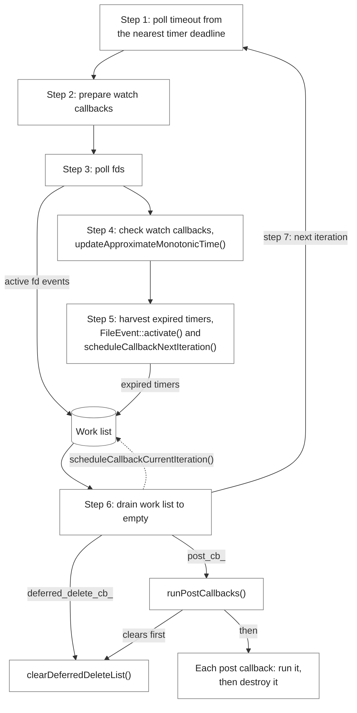
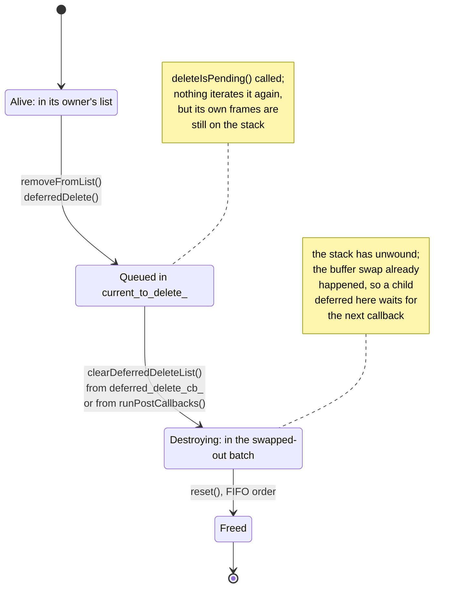
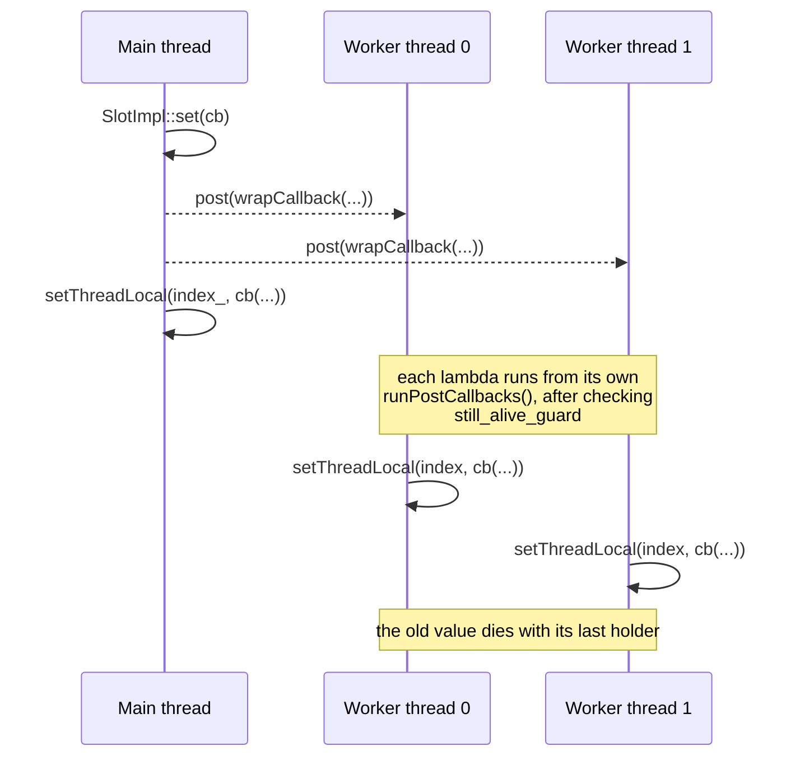

# 11. The Event Loop, Threading and Object Lifetime

*What lets every layer in Part II be written as single-threaded code, and how does
an object get destroyed while its own callback is still on the stack?*

Everything in Part II — listeners, filter chains, codecs, connection pools — is
written as if it were single-threaded code, because it is. A worker never takes a
lock to read a route table and never worries that a filter might be re-entered
from another core. That freedom is purchased by one machine, the dispatcher, and
three disciplines built on it: cross-thread work is expressed as a post, object
destruction is deferred to a safe point, and shared configuration is replicated
per thread rather than shared.

## One thread, one loop

[`Event::Dispatcher`](https://github.com/envoyproxy/envoy/blob/981d3923fed302ab44ee9fd265fb078d4aabbd85/envoy/event/dispatcher.h#L104) is a thread's
event loop and, by convention, the identity of the thread itself. It creates
file events, timers, signal handlers and connections; it owns a deferred-deletion
queue and a post queue. Its base interface is only two methods, and they are the
two that define the threading contract:

```cpp
class DispatcherBase {
public:
  virtual ~DispatcherBase() = default;

  /**
   * Posts a functor to the dispatcher. This is safe cross thread. The functor runs in the context
   * of the dispatcher event loop which may be on a different thread than the caller.
   */
  virtual void post(PostCb callback) PURE;

  /**
   * Validates that an operation is thread-safe with respect to this dispatcher; i.e. that the
   * current thread of execution is on the same thread upon which the dispatcher loop is running.
   */
  virtual bool isThreadSafe() const PURE;
};
```

`post` is safe from any thread. Almost nothing else is, and
[`DispatcherImpl`](https://github.com/envoyproxy/envoy/blob/981d3923fed302ab44ee9fd265fb078d4aabbd85/source/common/event/dispatcher_impl.h#L36)
enforces that by opening nearly every method with `ASSERT(isThreadSafe())`, which
compares the calling thread id against a `run_tid_` recorded by
[`run`](https://github.com/envoyproxy/envoy/blob/981d3923fed302ab44ee9fd265fb078d4aabbd85/source/common/event/dispatcher_impl.cc#L296) on entry.
Because `run_tid_` is empty until then, the assertions also pass on a dispatcher
whose loop has not started; the comment on `isThreadSafe` notes the allowance is
for tests that never invoke `run()`, and in production a worker's dispatcher is
allocated and wired up on the main thread by
[`ProdWorkerFactory::createWorker`](https://github.com/envoyproxy/envoy/blob/981d3923fed302ab44ee9fd265fb078d4aabbd85/source/server/worker_impl.cc#L39)
before [`WorkerImpl::start`](https://github.com/envoyproxy/envoy/blob/981d3923fed302ab44ee9fd265fb078d4aabbd85/source/server/worker_impl.cc#L112)
spawns the thread that runs it (see [Chapter 1](./01-process-model.md)).

## Inside one iteration

The dispatcher does not implement polling itself. It delegates to
[`LibeventScheduler`](https://github.com/envoyproxy/envoy/blob/981d3923fed302ab44ee9fd265fb078d4aabbd85/source/common/event/libevent_scheduler.h#L59),
a thin wrapper over an `event_base` held in a
[`Libevent::BasePtr`](https://github.com/envoyproxy/envoy/blob/981d3923fed302ab44ee9fd265fb078d4aabbd85/source/common/event/libevent.h#L36), a smart
pointer that binds `event_base_free` as the deleter. libevent is configured for
threaded use exactly once per process, by
[`Libevent::Global::initialize`](https://github.com/envoyproxy/envoy/blob/981d3923fed302ab44ee9fd265fb078d4aabbd85/source/common/event/libevent.h#L29);
`LibeventScheduler`'s constructor `RELEASE_ASSERT`s that this has happened.

One iteration, documented at length above that class, looks like this:


*Figure 11.1 — One iteration of the dispatch loop. Source:
[`LibeventScheduler`](https://github.com/envoyproxy/envoy/blob/981d3923fed302ab44ee9fd265fb078d4aabbd85/source/common/event/libevent_scheduler.h#L59),
[`DispatcherImpl::runPostCallbacks`](https://github.com/envoyproxy/envoy/blob/981d3923fed302ab44ee9fd265fb078d4aabbd85/source/common/event/dispatcher_impl.cc#L360).*

The prepare/check hooks are how the dispatcher piggybacks on the loop without
modifying it. The dispatcher constructor uses
[`registerOnCheckCallback`](https://github.com/envoyproxy/envoy/blob/981d3923fed302ab44ee9fd265fb078d4aabbd85/source/common/event/libevent_scheduler.cc#L93)
to refresh `approximateMonotonicTime()` once per iteration, so the thousands of
call sites that want "now" do not each make a syscall; the same hooks feed the
`loop_duration_us` and `poll_delay_us` histograms in
[`initializeStats`](https://github.com/envoyproxy/envoy/blob/981d3923fed302ab44ee9fd265fb078d4aabbd85/source/common/event/libevent_scheduler.cc#L101)
and are exposed to extensions as
[`Evwatch::Observer`](https://github.com/envoyproxy/envoy/blob/981d3923fed302ab44ee9fd265fb078d4aabbd85/envoy/event/evwatch.h#L18).

The critical property is the last step: the work list is drained to empty, and
items appended during the drain run in the same iteration.

## The three ways to get code to run

A [`FileEvent`](https://github.com/envoyproxy/envoy/blob/981d3923fed302ab44ee9fd265fb078d4aabbd85/envoy/event/file_event.h#L64) is a registration of an
fd with a callback.
[`FileEventImpl::assignEvents`](https://github.com/envoyproxy/envoy/blob/981d3923fed302ab44ee9fd265fb078d4aabbd85/source/common/event/file_event_impl.cc#L55)
translates Envoy's `Read`/`Write`/`Closed` bitmask into libevent flags, always
with `EV_PERSIST`. Trigger mode matters: `FileTriggerType` offers `Level`,
`Edge`, and `EmulatedEdge`. Connections use
`PlatformDefaultTriggerType` (edge on POSIX) and read until `EAGAIN`;
[`TcpListenerImpl`](https://github.com/envoyproxy/envoy/blob/981d3923fed302ab44ee9fd265fb078d4aabbd85/source/common/network/tcp_listener_impl.h#L17)
deliberately uses `Level`, because it accepts a bounded number of connections per
event and needs the kernel to re-notify it about the rest (see
[Chapter 4](./04-accept-path.md)). `EmulatedEdge` is a
level event made to behave like an edge one: it is disabled the moment it fires
and the consumer must re-arm it. Its main application is Win32, which has no
edge triggering, and it may only be used where `PlatformDefaultTriggerType` is
`EmulatedEdge` — Win32, or a POSIX build with `-DFORCE_LEVEL_EVENTS`.

[`FileEventImpl::activate`](https://github.com/envoyproxy/envoy/blob/981d3923fed302ab44ee9fd265fb078d4aabbd85/source/common/event/file_event_impl.cc#L35)
injects a readiness event the kernel never reported — this is how a filter that
buffered data makes the connection re-run its read path. Injected events are
merged with real ones in
[`mergeInjectedEventsAndRunCb`](https://github.com/envoyproxy/envoy/blob/981d3923fed302ab44ee9fd265fb078d4aabbd85/source/common/event/file_event_impl.cc#L143)
rather than delivered separately, and re-arming the fd discards them.

A [`Timer`](https://github.com/envoyproxy/envoy/blob/981d3923fed302ab44ee9fd265fb078d4aabbd85/envoy/event/timer.h#L28) is a libevent `evtimer`.
[`TimerImpl::internalEnableTimer`](https://github.com/envoyproxy/envoy/blob/981d3923fed302ab44ee9fd265fb078d4aabbd85/source/common/event/timer_impl.cc#L48)
converts a `std::chrono` duration with
[`TimerUtils::durationToTimeval`](https://github.com/envoyproxy/envoy/blob/981d3923fed302ab44ee9fd265fb078d4aabbd85/source/common/event/timer_impl.h#L31),
which clips at `INT32_MAX` seconds and `ENVOY_BUG`s on negative durations. Timers
optionally carry a scope-tracked object, pushed for the duration of the callback
by [`ScopeTrackerScopeState`](https://github.com/envoyproxy/envoy/blob/981d3923fed302ab44ee9fd265fb078d4aabbd85/source/common/common/scope_tracker.h#L18),
so a crash inside a timeout can dump the stream that owned it.

A [`SchedulableCallback`](https://github.com/envoyproxy/envoy/blob/981d3923fed302ab44ee9fd265fb078d4aabbd85/envoy/event/schedulable_cb.h#L14)
has two scheduling modes, and the distinction is subtle.
[`scheduleCallbackCurrentIteration`](https://github.com/envoyproxy/envoy/blob/981d3923fed302ab44ee9fd265fb078d4aabbd85/source/common/event/schedulable_cb_impl.cc#L23)
calls `event_active`, appending directly to the work list being drained;
[`scheduleCallbackNextIteration`](https://github.com/envoyproxy/envoy/blob/981d3923fed302ab44ee9fd265fb078d4aabbd85/source/common/event/schedulable_cb_impl.cc#L32)
arms a zero-delay timer, which libevent only harvests on its next sweep for
expired timers. Both are idempotent while pending.

[`DispatcherImpl::post`](https://github.com/envoyproxy/envoy/blob/981d3923fed302ab44ee9fd265fb078d4aabbd85/source/common/event/dispatcher_impl.cc#L268)
is built from a schedulable callback plus a mutex: the
functor is appended to `post_callbacks_` under `post_lock_`, and the callback is
armed only when the list transitions from empty. `post_lock_` protects the list,
never the execution:
[`runPostCallbacks`](https://github.com/envoyproxy/envoy/blob/981d3923fed302ab44ee9fd265fb078d4aabbd85/source/common/event/dispatcher_impl.cc#L360)
moves the whole list out under the lock, releases it, then runs and destroys each
functor one at a time — because a functor, or its destructor, is allowed to
`post()` again.

## Deferred deletion

Consider a connection whose read callback discovers a socket error. The
connection is on the current call stack: the filter that noticed was called by
the filter manager, called by the codec, called by `ConnectionImpl::onFileEvent`,
a member function of the object we want to destroy. `delete this` here corrupts
every frame above.

The answer is
[`DeferredDeletable`](https://github.com/envoyproxy/envoy/blob/981d3923fed302ab44ee9fd265fb078d4aabbd85/envoy/event/deferred_deletable.h#L13):
inherit from it, and ownership can be handed to
[`deferredDelete`](https://github.com/envoyproxy/envoy/blob/981d3923fed302ab44ee9fd265fb078d4aabbd85/source/common/event/dispatcher_impl.cc#L249),
which pushes the `unique_ptr` onto a list and arms a current-iteration callback.
Destruction happens after the whole callback stack has unwound, still within the
same loop iteration.


*Figure 11.2 — The life of one deferred-deleted object. Source:
[`DispatcherImpl::deferredDelete`](https://github.com/envoyproxy/envoy/blob/981d3923fed302ab44ee9fd265fb078d4aabbd85/source/common/event/dispatcher_impl.cc#L249),
[`DispatcherImpl::clearDeferredDeleteList`](https://github.com/envoyproxy/envoy/blob/981d3923fed302ab44ee9fd265fb078d4aabbd85/source/common/event/dispatcher_impl.cc#L119),
[`DeferredDeletable`](https://github.com/envoyproxy/envoy/blob/981d3923fed302ab44ee9fd265fb078d4aabbd85/envoy/event/deferred_deletable.h#L13).*

The list is double-buffered, because a destructor commonly defers-deletes its own
children:

```cpp
  // Swap the current deletion vector so that if we do deferred delete while we are deleting, we
  // use the other vector. We will get another callback to delete that vector.
  if (current_to_delete_ == &to_delete_1_) {
    current_to_delete_ = &to_delete_2_;
  } else {
    current_to_delete_ = &to_delete_1_;
  }
```

[`clearDeferredDeleteList`](https://github.com/envoyproxy/envoy/blob/981d3923fed302ab44ee9fd265fb078d4aabbd85/source/common/event/dispatcher_impl.cc#L119)
swaps buffers, sets a `deferred_deleting_` reentrancy guard, and resets the
pointers in FIFO order by hand, since `std::vector::clear` does not specify
destruction order. `runPostCallbacks` drains this list first, so a post that
refers to a dying object fails loudly rather than intermittently.

The canonical call site combines two mechanisms:
[`OwnedActiveStreamListenerBase::removeConnection`](https://github.com/envoyproxy/envoy/blob/981d3923fed302ab44ee9fd265fb078d4aabbd85/source/common/listener_manager/active_stream_listener_base.cc#L127)
pulls the connection out of its list with `removeFromList`, which yields the
owning `unique_ptr`, and passes it straight to `deferredDelete`.
[`DeferredTaskUtil::deferredRun`](https://github.com/envoyproxy/envoy/blob/981d3923fed302ab44ee9fd265fb078d4aabbd85/source/common/event/deferred_task.h#L29)
reuses the same queue to run an arbitrary function after the current batch of
deletions, by wrapping it in an object whose destructor is the task.

A related facility,
[`deleteInDispatcherThread`](https://github.com/envoyproxy/envoy/blob/981d3923fed302ab44ee9fd265fb078d4aabbd85/source/common/event/dispatcher_impl.cc#L281),
takes a
[`DispatcherThreadDeletable`](https://github.com/envoyproxy/envoy/blob/981d3923fed302ab44ee9fd265fb078d4aabbd85/envoy/event/dispatcher_thread_deletable.h#L13)
from *any* thread and destroys it on the dispatcher's thread, so a worker holding
the last reference to a config object does not run its destructor.

## Thread-local storage and update-then-broadcast

The reason workers can read configuration without synchronisation is
[`ThreadLocal::Slot`](https://github.com/envoyproxy/envoy/blob/981d3923fed302ab44ee9fd265fb078d4aabbd85/envoy/thread_local/thread_local.h#L21), handed out by a
[`SlotAllocator`](https://github.com/envoyproxy/envoy/blob/981d3923fed302ab44ee9fd265fb078d4aabbd85/envoy/thread_local/thread_local.h#L95). A slot is
an index; the storage is a `thread_local` vector of `shared_ptr`s inside
[`InstanceImpl`](https://github.com/envoyproxy/envoy/blob/981d3923fed302ab44ee9fd265fb078d4aabbd85/source/common/thread_local/thread_local_impl.h#L20),
so reading is a vector index and a pointer dereference. Callers normally use the
type-safe wrapper
[`TypedSlot<T>`](https://github.com/envoyproxy/envoy/blob/981d3923fed302ab44ee9fd265fb078d4aabbd85/envoy/thread_local/thread_local.h#L111), which returns
an `OptRef<T>`.

Writing is where the discipline lives.
[`SlotImpl::set`](https://github.com/envoyproxy/envoy/blob/981d3923fed302ab44ee9fd265fb078d4aabbd85/source/common/thread_local/thread_local_impl.cc#L124)
posts a construction lambda to every registered dispatcher, and
[`runOnAllThreads`](https://github.com/envoyproxy/envoy/blob/981d3923fed302ab44ee9fd265fb078d4aabbd85/source/common/thread_local/thread_local_impl.cc#L179)
posts an update lambda; each worker applies the change at a safe point in its own
loop. Because the stored value is a `shared_ptr`, a worker mid-request keeps the
old object alive until it drops its reference — read-copy-update without a reader
lock. The two-argument overload adds a completion barrier by capturing a
`shared_ptr` whose custom deleter posts back to the main thread once the last
worker has dropped it.


*Figure 11.3 — Publishing a new value into a thread-local slot. Source:
[`SlotImpl::set`](https://github.com/envoyproxy/envoy/blob/981d3923fed302ab44ee9fd265fb078d4aabbd85/source/common/thread_local/thread_local_impl.cc#L124),
[`InstanceImpl::setThreadLocal`](https://github.com/envoyproxy/envoy/blob/981d3923fed302ab44ee9fd265fb078d4aabbd85/source/common/thread_local/thread_local_impl.cc#L211),
[`SlotImpl::wrapCallback`](https://github.com/envoyproxy/envoy/blob/981d3923fed302ab44ee9fd265fb078d4aabbd85/source/common/thread_local/thread_local_impl.cc#L73).*

Slots are allocated and destroyed on the main thread only, but callbacks may be
in flight on workers when a slot dies. Two mechanisms cover that. Every posted
lambda captures a `weak_ptr` to a `still_alive_guard_` sentinel and checks
`expired()` before running — see
[`wrapCallback`](https://github.com/envoyproxy/envoy/blob/981d3923fed302ab44ee9fd265fb078d4aabbd85/source/common/thread_local/thread_local_impl.cc#L73)
— which is why such callbacks must never capture the slot object directly, and
why `index_` is captured by value. And
[`removeSlot`](https://github.com/envoyproxy/envoy/blob/981d3923fed302ab44ee9fd265fb078d4aabbd85/source/common/thread_local/thread_local_impl.cc#L152)
returns the index to the free list immediately, then broadcasts a clear to every
thread; since all slot traffic goes through `post()`, any callback posted for the
recycled index is necessarily sequenced after that clear. The cluster manager's
per-worker view of every cluster is this idiom at its largest scale (see
[Chapter 8](./08-upstream.md)).

Shutdown reverses the flow:
[`shutdownGlobalThreading`](https://github.com/envoyproxy/envoy/blob/981d3923fed302ab44ee9fd265fb078d4aabbd85/source/common/thread_local/thread_local_impl.cc#L219)
sets a flag that stops further cross-thread posting, and each worker calls
[`shutdownThread`](https://github.com/envoyproxy/envoy/blob/981d3923fed302ab44ee9fd265fb078d4aabbd85/source/common/thread_local/thread_local_impl.cc#L225)
on its own thread, destroying slot contents in reverse index order so that leaf
objects go before the long-lived ones they point at.

## Liveness and scaling

Because the loop is cooperative, a filter that blocks stalls every connection on
that worker.
[`registerWatchdog`](https://github.com/envoyproxy/envoy/blob/981d3923fed302ab44ee9fd265fb078d4aabbd85/source/common/event/dispatcher_impl.cc#L94)
installs a periodic timer that touches a
[`WatchDogImpl`](https://github.com/envoyproxy/envoy/blob/981d3923fed302ab44ee9fd265fb078d4aabbd85/source/server/watchdog_impl.h#L14) — one relaxed
atomic bool — but the more important half is that
[`touchWatchdog`](https://github.com/envoyproxy/envoy/blob/981d3923fed302ab44ee9fd265fb078d4aabbd85/source/common/event/dispatcher_impl.cc#L414)
also runs from the wrappers around every fd callback, timer, post callback and
deferred deletion. A thread grinding through a long work list is not reported as
stuck; only one wedged inside a single callback is. The scanning side,
[`GuardDogImpl::step`](https://github.com/envoyproxy/envoy/blob/981d3923fed302ab44ee9fd265fb078d4aabbd85/source/server/guarddog_impl.cc#L106), is
covered in Chapter 1.

Under load, Envoy would rather shorten its own timeouts than drop traffic. Timers
created via
[`createScaledTimer`](https://github.com/envoyproxy/envoy/blob/981d3923fed302ab44ee9fd265fb078d4aabbd85/source/common/event/dispatcher_impl.cc#L222)
go to
[`ScaledRangeTimerManagerImpl`](https://github.com/envoyproxy/envoy/blob/981d3923fed302ab44ee9fd265fb078d4aabbd85/source/common/event/scaled_range_timer_manager_impl.h#L24),
which reads the duration as a range: a
[`ScaledTimerMinimum`](https://github.com/envoyproxy/envoy/blob/981d3923fed302ab44ee9fd265fb078d4aabbd85/envoy/event/scaled_timer.h#L38) derives
a floor from the configured maximum, absolute or fractional. A real timer runs
for the minimum, then the timer joins a queue keyed by `max - min` whose firing
time is the scale factor applied to that remainder. The overload manager adjusts
the factor through
[`setScaleFactor`](https://github.com/envoyproxy/envoy/blob/981d3923fed302ab44ee9fd265fb078d4aabbd85/source/common/event/scaled_range_timer_manager_impl.cc#L166);
at zero, idle connections close the instant their minimum expires. Only an
enumerated set of timer types is eligible, so an operator cannot accidentally
scale a correctness-critical timeout.

## Ownership idioms

Single-threaded ownership makes RAII sufficient, and the codebase leans on a
small vocabulary. [`Cleanup`](https://github.com/envoyproxy/envoy/blob/981d3923fed302ab44ee9fd265fb078d4aabbd85/source/common/common/cleanup.h#L11) runs a
functor at scope exit unless cancelled;
[`LinkedObject`](https://github.com/envoyproxy/envoy/blob/981d3923fed302ab44ee9fd265fb078d4aabbd85/source/common/common/linked_object.h#L48) and the
newer [`IntrusiveList`](https://github.com/envoyproxy/envoy/blob/981d3923fed302ab44ee9fd265fb078d4aabbd85/source/common/common/linked_object.h#L270)
give containers that own their elements through `unique_ptr` while allowing an
element to remove *itself* in O(1) and reclaim its own ownership — the
precondition for the `removeFromList` / `deferredDelete` pairing above.

Observer registration uses
[`Common::CallbackManager`](https://github.com/envoyproxy/envoy/blob/981d3923fed302ab44ee9fd265fb078d4aabbd85/source/common/common/callback_impl.h#L24),
whose `add()` is `ABSL_MUST_USE_RESULT` and hands back a
[`CallbackHandle`](https://github.com/envoyproxy/envoy/blob/981d3923fed302ab44ee9fd265fb078d4aabbd85/envoy/common/callback.h#L14):
destroying the handle deregisters the callback, guarded
by a `weak_ptr` sentinel in case the manager died first.
[`ThreadSafeCallbackManager`](https://github.com/envoyproxy/envoy/blob/981d3923fed302ab44ee9fd265fb078d4aabbd85/source/common/common/callback_impl.h#L133)
records the registering dispatcher alongside each callback and posts invocations
back to it — cross-thread notification, again, as a post.

The naming conventions are load-bearing. A `FooPtr` parameter is a transfer of
sole ownership; a `FooConstSharedPtr` member is an immutable snapshot someone
else may still be reading; an
[`OptRef<Foo>`](https://github.com/envoyproxy/envoy/blob/981d3923fed302ab44ee9fd265fb078d4aabbd85/envoy/common/optref.h#L19) is a nullable reference costing
one pointer; and a bare reference is a promise that the referent outlives you on
this thread.
