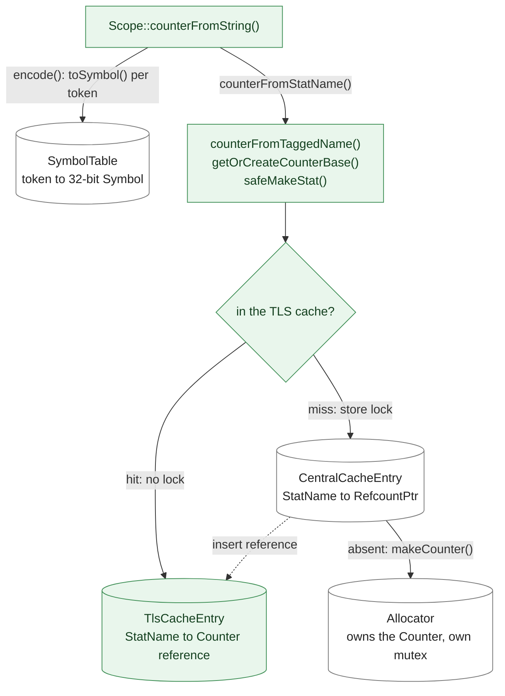
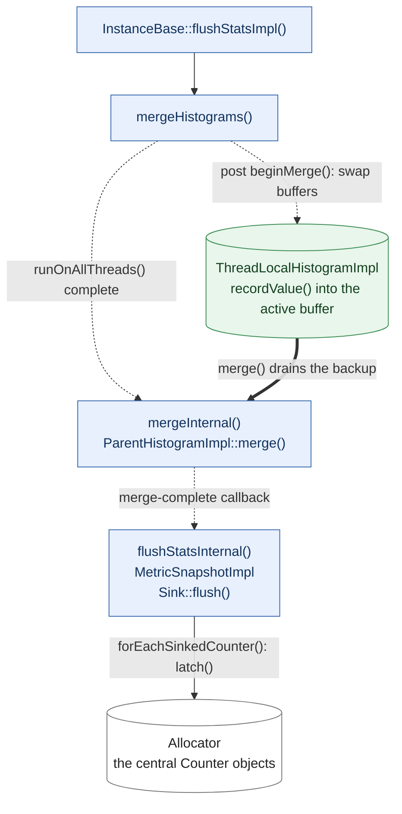
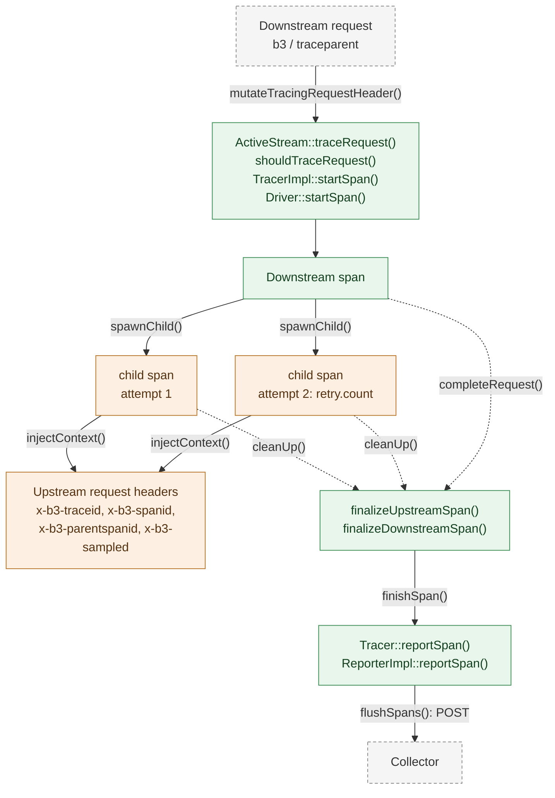

# 13. Stats, Logging, Tracing, Runtime and the Admin Interface

*How do you find out what a running Envoy is doing, and how do you change its
behaviour without restarting it?*

Everything in the previous chapters exists to move bytes. This chapter is about
the machinery that lets you find out what those bytes did, change the proxy's
behaviour without restarting it, and get a usable post-mortem when the process
dies. It is written to be very cheap on the data path and expensive only when an
operator asks a question.

## Stat names are interned, not strings

A busy Envoy has hundreds of thousands of counters with long, enormously
repetitive names: `cluster.outbound|80||foo.svc.upstream_rq_2xx`,
`cluster.outbound|80||foo.svc.upstream_rq_5xx`, and so on per cluster. A
`std::string` per metric would waste memory on a scale that matters, so Envoy
interns them. [`SymbolTable`](https://github.com/envoyproxy/envoy/blob/981d3923fed302ab44ee9fd265fb078d4aabbd85/source/common/stats/symbol_table.h#L76)
splits a dotted name into tokens, maps each distinct token to a 32-bit `Symbol`
via [`toSymbol`](https://github.com/envoyproxy/envoy/blob/981d3923fed302ab44ee9fd265fb078d4aabbd85/source/common/stats/symbol_table.cc#L460),
and packs the symbol array into a variable-length byte encoding modelled loosely
on UTF-8: seven value bits per byte, so a symbol below 128 costs one byte and
higher-numbered ones spill into further bytes. The packed bytes are a
`StatName`, a small non-owning handle. Symbols are reference counted,
so a token's storage is reclaimed with the last stat using it.

Interning is only free once a name is in the table.
[`addTokensToEncoding`](https://github.com/envoyproxy/envoy/blob/981d3923fed302ab44ee9fd265fb078d4aabbd85/source/common/stats/symbol_table.cc#L266)
takes a global lock and records the name in a bounded ring of recent lookups.
That is what `/stats/recentlookups` and
[`getRecentLookups`](https://github.com/envoyproxy/envoy/blob/981d3923fed302ab44ee9fd265fb078d4aabbd85/source/common/stats/symbol_table.cc#L384)
report: a name appearing there repeatedly means some code path is re-encoding a
string on the hot path instead of caching a `StatName`.

The metric types are plain: [`Counter`](https://github.com/envoyproxy/envoy/blob/981d3923fed302ab44ee9fd265fb078d4aabbd85/envoy/stats/stats.h#L126) with
`inc`/`add`/`latch`, [`Gauge`](https://github.com/envoyproxy/envoy/blob/981d3923fed302ab44ee9fd265fb078d4aabbd85/envoy/stats/stats.h#L142) with an `ImportMode`
controlling hot-restart transfer, and `Histogram`. All derive from
[`Metric`](https://github.com/envoyproxy/envoy/blob/981d3923fed302ab44ee9fd265fb078d4aabbd85/envoy/stats/stats.h#L34), which exposes both the full name and a
*tag-extracted* name. A [`Scope`](https://github.com/envoyproxy/envoy/blob/981d3923fed302ab44ee9fd265fb078d4aabbd85/envoy/stats/scope.h#L71) is a named prefix;
creating a stat through a scope prepends the scope's `StatName` without re-parsing
a string. Most subsystems never touch these APIs directly — they declare a struct
of stat references using the `POOL_COUNTER`/`POOL_GAUGE` macros in
[`envoy/stats/stats_macros.h`](https://github.com/envoyproxy/envoy/blob/981d3923fed302ab44ee9fd265fb078d4aabbd85/envoy/stats/stats_macros.h), which does the
lookups once at construction.

## The thread-local store

Counters must be incrementable from workers without contention, but the set of
live counters is global. The reconciliation is
[`ThreadLocalStoreImpl`](https://github.com/envoyproxy/envoy/blob/981d3923fed302ab44ee9fd265fb078d4aabbd85/source/common/stats/thread_local_store.h#L164):
a central map per scope guarded by a mutex, plus a per-thread cache of references
into it.

[`safeMakeStat`](https://github.com/envoyproxy/envoy/blob/981d3923fed302ab44ee9fd265fb078d4aabbd85/source/common/stats/thread_local_store.cc#L536)
is the whole design in one function, drawn below. The thread-local entry is a
bare reference,
not a ref-count, because dropping a ref-count needs the allocator lock and would
storm on scope destruction; so teardown is two-phase, with
`releaseScopeCrossThread` keeping the central cache — which owns the
`RefcountPtr`s — alive until every thread-local cache has been purged.


*Figure 13.1 — Incrementing one counter: encode once, then two caches and the
allocator behind them; the uncoloured boxes are shared state, each behind its own
lock. Source:
[`ScopeImpl::safeMakeStat`](https://github.com/envoyproxy/envoy/blob/981d3923fed302ab44ee9fd265fb078d4aabbd85/source/common/stats/thread_local_store.cc#L536),
[`ScopeImpl::getOrCreateCounterBase`](https://github.com/envoyproxy/envoy/blob/981d3923fed302ab44ee9fd265fb078d4aabbd85/source/common/stats/thread_local_store.cc#L627),
[`SymbolTable::addTokensToEncoding`](https://github.com/envoyproxy/envoy/blob/981d3923fed302ab44ee9fd265fb078d4aabbd85/source/common/stats/symbol_table.cc#L266),
[`Allocator::makeCounter`](https://github.com/envoyproxy/envoy/blob/981d3923fed302ab44ee9fd265fb078d4aabbd85/source/common/stats/allocator.cc#L297).*

Histograms cannot work that way, since merging quantiles is not an atomic
increment. Each thread gets a
[`ThreadLocalHistogramImpl`](https://github.com/envoyproxy/envoy/blob/981d3923fed302ab44ee9fd265fb078d4aabbd85/source/common/stats/thread_local_store.h#L36)
holding *two* underlying histograms.

[`mergeHistograms`](https://github.com/envoyproxy/envoy/blob/981d3923fed302ab44ee9fd265fb078d4aabbd85/source/common/stats/thread_local_store.cc#L272)
is arranged so that no worker ever blocks for a merge: all a worker is asked to
run is a pointer swap.

The flush loop itself is
[`InstanceBase::flushStatsImpl`](https://github.com/envoyproxy/envoy/blob/981d3923fed302ab44ee9fd265fb078d4aabbd85/source/server/server.cc#L238),
which refuses to re-enter if a flush is outstanding, merges histograms, refreshes
process gauges in
[`updateServerStats`](https://github.com/envoyproxy/envoy/blob/981d3923fed302ab44ee9fd265fb078d4aabbd85/source/server/server.cc#L261),
then calls
[`flushMetricsToSinks`](https://github.com/envoyproxy/envoy/blob/981d3923fed302ab44ee9fd265fb078d4aabbd85/source/server/server.cc#L225)
to build a [`MetricSnapshotImpl`](https://github.com/envoyproxy/envoy/blob/981d3923fed302ab44ee9fd265fb078d4aabbd85/source/server/server.h#L471)
and hand it to each [`Sink`](https://github.com/envoyproxy/envoy/blob/981d3923fed302ab44ee9fd265fb078d4aabbd85/envoy/stats/sink.h#L93). Snapshot construction
latches all counter deltas whether or not a sink is configured — hot restart (see
[Chapter 1](./01-process-model.md)) depends on it. Sinks are extensions under `source/extensions/stat_sinks/`:
`statsd`, `dog_statsd`, `graphite_statsd`, `metrics_service`, `open_telemetry`.
`Sink::onHistogramComplete` is different: it is called synchronously on the
recording thread from
[`deliverHistogramToSinks`](https://github.com/envoyproxy/envoy/blob/981d3923fed302ab44ee9fd265fb078d4aabbd85/source/common/stats/thread_local_store.cc#L655),
so those implementations must be thread-safe.


*Figure 13.2 — The flush: every step but the buffer swap runs on the main thread,
and the snapshot latches the allocator's counters, not the per-worker caches.
Source:
[`ThreadLocalStoreImpl::mergeHistograms`](https://github.com/envoyproxy/envoy/blob/981d3923fed302ab44ee9fd265fb078d4aabbd85/source/common/stats/thread_local_store.cc#L272),
[`ThreadLocalHistogramImpl::merge`](https://github.com/envoyproxy/envoy/blob/981d3923fed302ab44ee9fd265fb078d4aabbd85/source/common/stats/thread_local_store.cc#L1071),
[`InstanceBase::flushStatsImpl`](https://github.com/envoyproxy/envoy/blob/981d3923fed302ab44ee9fd265fb078d4aabbd85/source/server/server.cc#L238),
[`MetricSnapshotImpl`](https://github.com/envoyproxy/envoy/blob/981d3923fed302ab44ee9fd265fb078d4aabbd85/source/server/server.cc#L170),
[`Allocator::forEachSinkedCounter`](https://github.com/envoyproxy/envoy/blob/981d3923fed302ab44ee9fd265fb078d4aabbd85/source/common/stats/allocator.cc#L399).*

Two filters sit in front of creation. A
[`StatsMatcher`](https://github.com/envoyproxy/envoy/blob/981d3923fed302ab44ee9fd265fb078d4aabbd85/envoy/stats/stats_matcher.h#L12) can reject a name,
returning a null stat with nothing allocated; rejection is two-phase, a cheap
`fastRejects` on the `StatName` and a `slowRejects` that may stringify, memoised
per thread. Tag extraction runs at creation:
[`produceTags`](https://github.com/envoyproxy/envoy/blob/981d3923fed302ab44ee9fd265fb078d4aabbd85/source/common/stats/tag_producer_impl.cc#L126)
applies regexes built by
[`createTagExtractor`](https://github.com/envoyproxy/envoy/blob/981d3923fed302ab44ee9fd265fb078d4aabbd85/source/common/stats/tag_extractor_impl.cc#L70)
and returns the name with matched spans removed. That is how
`cluster.foo.upstream_rq_total` becomes tag `envoy.cluster_name=foo` on metric
`cluster.upstream_rq_total` for dimension-aware backends while staying flat for
statsd.

## Logging

Envoy wraps spdlog. There is a fixed set of logger IDs — the `ALL_LOGGER_IDS`
list in [`logger.h`](https://github.com/envoyproxy/envoy/blob/981d3923fed302ab44ee9fd265fb078d4aabbd85/source/common/common/logger.h) — and a class opts into
one by inheriting [`Loggable<Id::foo>`](https://github.com/envoyproxy/envoy/blob/981d3923fed302ab44ee9fd265fb078d4aabbd85/source/common/common/logger.h#L380),
which gives it a static `spdlog::logger&`. `ENVOY_LOG(debug, ...)` expands to a
level comparison against that logger before the formatted call, so argument
expressions are not evaluated when the level is suppressed. All loggers share one
[`DelegatingLogSink`](https://github.com/envoyproxy/envoy/blob/981d3923fed302ab44ee9fd265fb078d4aabbd85/source/common/common/logger.h#L204), which
can be stacked to redirect output and holds the lock that keeps lines from
different threads intact;
[`Registry`](https://github.com/envoyproxy/envoy/blob/981d3923fed302ab44ee9fd265fb078d4aabbd85/source/common/common/logger.h#L319) owns the loggers and the
level-setting entry points, and [`Context`](https://github.com/envoyproxy/envoy/blob/981d3923fed302ab44ee9fd265fb078d4aabbd85/source/common/common/logger.h#L281)
installs a level, format and lock for a scope.

`ENVOY_CONN_LOG` and `ENVOY_STREAM_LOG` are not just prefixes. They build a tag
map containing `ConnectionId` (and `StreamId` for the stream variant) and prepend
it via `serializeLogTags`, which is what makes grep-by-connection work across the
whole filter chain.

Fine-grain logging is an alternative addressing scheme: every source file gets its
own logger.
[`FineGrainLogContext`](https://github.com/envoyproxy/envoy/blob/981d3923fed302ab44ee9fd265fb078d4aabbd85/source/common/common/fine_grain_logger.h#L41)
keys them by `__FILE__` and supports glob verbosity updates; when enabled,
`ENVOY_LOG_TO_LOGGER` silently routes there and ignores the component ID. The
admin endpoint covers both worlds:
[`changeLogLevel`](https://github.com/envoyproxy/envoy/blob/981d3923fed302ab44ee9fd265fb078d4aabbd85/source/server/admin/logs_handler.cc#L88)
takes `?level=` to change everything and `?paths=` to change a list of component
loggers or a list of file globs, depending on which mode is active.

## Crashing usefully

[`assert.h`](https://github.com/envoyproxy/envoy/blob/981d3923fed302ab44ee9fd265fb078d4aabbd85/source/common/common/assert.h) defines three levels of "this
should not happen". `ASSERT` compiles out entirely in release builds.
`RELEASE_ASSERT` always aborts. `ENVOY_BUG` is the interesting one: in debug
builds it aborts, while in release it logs, captures a stack trace and invokes a
registered action instead — and either way it fires only on power-of-two hit
counts per call site, so a bug hit a million times a second does not become a log
flood.

When a fatal signal arrives,
[`SignalAction::sigHandler`](https://github.com/envoyproxy/envoy/blob/981d3923fed302ab44ee9fd265fb078d4aabbd85/source/common/signal/signal_action.cc#L15)
runs on an alternate stack, captures a backtrace with
[`BackwardsTrace`](https://github.com/envoyproxy/envoy/blob/981d3923fed302ab44ee9fd265fb078d4aabbd85/source/server/backtrace.h#L40), then runs fatal
actions in two waves. The split matters: a
[`FatalAction`](https://github.com/envoyproxy/envoy/blob/981d3923fed302ab44ee9fd265fb078d4aabbd85/envoy/server/fatal_action_config.h#L17) declares via
`isAsyncSignalSafe` whether it may allocate. Safe actions run first; only if they
complete does the handler call the error handlers and then the unsafe actions.
[`fatal_error_handler.cc`](https://github.com/envoyproxy/envoy/blob/981d3923fed302ab44ee9fd265fb078d4aabbd85/source/common/signal/fatal_error_handler.cc)
arbitrates with an atomic thread-ID compare-exchange so exactly one thread runs
them, and swaps the handler list pointer atomically rather than locking, because
locks are not signal-safe.

That handler list is how you get context rather than just a stack.
[`DispatcherImpl::onFatalError`](https://github.com/envoyproxy/envoy/blob/981d3923fed302ab44ee9fd265fb078d4aabbd85/source/common/event/dispatcher_impl.cc#L390)
walks the dispatcher's tracked-object stack — the scope-tracking mechanism of
[Chapter 11](./11-event-loop-and-threading.md) — top down, calling `dumpState` on each, so a crash inside a filter
prints the connection, stream and headers it was working on.

## Tracing

A [`Tracer`](https://github.com/envoyproxy/envoy/blob/981d3923fed302ab44ee9fd265fb078d4aabbd85/envoy/tracing/tracer.h#L17) has exactly one method,
`startSpan`. Vendor-specific work happens behind
[`Driver`](https://github.com/envoyproxy/envoy/blob/981d3923fed302ab44ee9fd265fb078d4aabbd85/envoy/tracing/trace_driver.h#L185), and what comes back is a
[`Span`](https://github.com/envoyproxy/envoy/blob/981d3923fed302ab44ee9fd265fb078d4aabbd85/envoy/tracing/trace_driver.h#L61) that can set tags, spawn children,
inject context into outbound headers, and finish.

The sampling decision precedes the span.
[`mutateTracingRequestHeader`](https://github.com/envoyproxy/envoy/blob/981d3923fed302ab44ee9fd265fb078d4aabbd85/source/common/http/conn_manager_utility.cc#L390)
consults the request-ID extension and three runtime-backed percentages —
`tracing.client_enabled`, `tracing.random_sampling`, `tracing.global_enabled` — to
produce a `Tracing::Reason` stored on the stream info.
[`shouldTraceRequest`](https://github.com/envoyproxy/envoy/blob/981d3923fed302ab44ee9fd265fb078d4aabbd85/source/common/tracing/tracer_impl.cc#L70)
maps that to a boolean: health-check traffic is excluded outright, and only
`ClientForced`, `ServiceForced` and `Sampling` are traced.

[`ActiveStream::traceRequest`](https://github.com/envoyproxy/envoy/blob/981d3923fed302ab44ee9fd265fb078d4aabbd85/source/common/http/conn_manager_impl.cc#L1608)
creates the downstream span just before the decoder filter chain runs, so every
filter reaches it through `activeSpan()`. Because route selection can happen after
that, `refreshTracing` re-runs the computation — picking up the route's own
percentages if it has any — and calls `setSampled`, but only if the span reports
`useLocalDecision`, since a tracer driving its own sampler or an external trace
context ignores Envoy's decision anyway. The router's
[`UpstreamRequest`](https://github.com/envoyproxy/envoy/blob/981d3923fed302ab44ee9fd265fb078d4aabbd85/source/common/router/upstream_request.cc#L99)
constructor spawns a child span when one is configured, falling back to injecting
the parent span's context when there is no child. At stream destruction
[`finalizeDownstreamSpan`](https://github.com/envoyproxy/envoy/blob/981d3923fed302ab44ee9fd265fb078d4aabbd85/source/common/tracing/http_tracer_impl.cc#L148)
tags the span with the request URL, method, peer address and byte counts, adds
the shared tags — upstream cluster, status code, response flags — in
[`setCommonTags`](https://github.com/envoyproxy/envoy/blob/981d3923fed302ab44ee9fd265fb078d4aabbd85/source/common/tracing/http_tracer_impl.cc#L239),
and calls `finishSpan`.


*Figure 13.3 — One request, two attempts, three spans; header names and the
reporter are the Zipkin driver's. Source:
[`ActiveStream::traceRequest`](https://github.com/envoyproxy/envoy/blob/981d3923fed302ab44ee9fd265fb078d4aabbd85/source/common/http/conn_manager_impl.cc#L1608),
[`UpstreamRequest::UpstreamRequest`](https://github.com/envoyproxy/envoy/blob/981d3923fed302ab44ee9fd265fb078d4aabbd85/source/common/router/upstream_request.cc#L99),
[`Span::injectContext`](https://github.com/envoyproxy/envoy/blob/981d3923fed302ab44ee9fd265fb078d4aabbd85/source/extensions/tracers/zipkin/zipkin_core_types.cc#L217),
[`HttpTracerUtility::finalizeDownstreamSpan`](https://github.com/envoyproxy/envoy/blob/981d3923fed302ab44ee9fd265fb078d4aabbd85/source/common/tracing/http_tracer_impl.cc#L148),
[`ReporterImpl::flushSpans`](https://github.com/envoyproxy/envoy/blob/981d3923fed302ab44ee9fd265fb078d4aabbd85/source/extensions/tracers/zipkin/zipkin_tracer_impl.cc#L198).*

## Trace context and propagation

A driver is not written against HTTP headers. What it gets is a
[`TraceContext`](https://github.com/envoyproxy/envoy/blob/981d3923fed302ab44ee9fd265fb078d4aabbd85/envoy/tracing/trace_context.h#L23): `protocol`, `host`,
`path` and `method`, plus `get`, `set`, `remove` and `forEach` over whatever key/value
carrier the protocol happens to have, and an optional `requestHeaders()` that is empty
unless the carrier really is an HTTP request. The HTTP implementation
[`HttpTraceContext`](https://github.com/envoyproxy/envoy/blob/981d3923fed302ab44ee9fd265fb078d4aabbd85/source/common/tracing/http_tracer_impl.h#L60)
wraps a `RequestHeaderMap`; the generic proxy supplies
[`TraceContextBridge`](https://github.com/envoyproxy/envoy/blob/981d3923fed302ab44ee9fd265fb078d4aabbd85/source/extensions/filters/network/generic_proxy/tracing.h#L15)
over its own request object. One Zipkin driver serves both.

Keys are not rebuilt per request. Each propagated header is a static
[`TraceContextHandler`](https://github.com/envoyproxy/envoy/blob/981d3923fed302ab44ee9fd265fb078d4aabbd85/source/common/tracing/trace_context_impl.h#L18)
built once from its key, which resolves at construction to an inline-header handle if the
key is registered in the custom inline header registry; when the carrier is not HTTP every
accessor falls back to the generic `get`/`set`/`remove`. Its
[`setRef`](https://github.com/envoyproxy/envoy/blob/981d3923fed302ab44ee9fd265fb078d4aabbd85/source/common/tracing/trace_context_impl.cc#L46) variants avoid
copying key or value.

Three propagation formats matter. Zipkin uses b3 — the
[`X_B3_TRACE_ID`](https://github.com/envoyproxy/envoy/blob/981d3923fed302ab44ee9fd265fb078d4aabbd85/source/extensions/tracers/zipkin/zipkin_core_constants.h#L48)
family plus the single-header `b3` form. OpenTelemetry uses W3C
`traceparent`/`tracestate`, parsed by
[`SpanContextExtractor`](https://github.com/envoyproxy/envoy/blob/981d3923fed302ab44ee9fd265fb078d4aabbd85/source/extensions/tracers/opentelemetry/span_context_extractor.h#L28),
which the Zipkin extractor can fall back to when configured. And Envoy has one of its
own: with `pack_trace_reason` enabled the decision is written into byte 14 of the
`x-request-id` UUID, so
[`getTraceReason`](https://github.com/envoyproxy/envoy/blob/981d3923fed302ab44ee9fd265fb078d4aabbd85/source/extensions/request_id/uuid/config.cc#L80)
recovers `ServiceForced`, `Sampling` or `ClientForced` at the next hop with no vendor
format involved at all.

## From child span to collector

The router's child span is per *attempt*, not per request. Every retry or hedged request
builds a fresh `UpstreamRequest` and therefore a fresh
[`spawnChild`](https://github.com/envoyproxy/envoy/blob/981d3923fed302ab44ee9fd265fb078d4aabbd85/envoy/tracing/trace_driver.h#L105), tagged `retry.count` with
the number of preceding attempts whenever this is not the first one; a reset adds
`error` and `error.reason`, a cancelled attempt
adds `canceled`, and
[`finalizeUpstreamSpan`](https://github.com/envoyproxy/envoy/blob/981d3923fed302ab44ee9fd265fb078d4aabbd85/source/common/tracing/http_tracer_impl.cc#L205)
closes each one separately. A request that took three tries shows three sibling spans
with three upstream hosts and durations — the only way to see *which* attempt was slow.
Setting
[`noContextPropagation`](https://github.com/envoyproxy/envoy/blob/981d3923fed302ab44ee9fd265fb078d4aabbd85/envoy/tracing/trace_config.h#L55) keeps the
spans but injects nothing upstream.

Tracers are shared, not per listener.
[`getOrCreateTracer`](https://github.com/envoyproxy/envoy/blob/981d3923fed302ab44ee9fd265fb078d4aabbd85/source/common/tracing/tracer_manager_impl.cc#L14)
keys a cache of weak references by the hash of the tracing config, so listeners with
identical configuration share one driver. Export is the driver's business, and always
asynchronous: Zipkin's
[`ReporterImpl`](https://github.com/envoyproxy/envoy/blob/981d3923fed302ab44ee9fd265fb078d4aabbd85/source/extensions/tracers/zipkin/zipkin_tracer_impl.cc#L161)
buffers finished spans per worker and
[`flushSpans`](https://github.com/envoyproxy/envoy/blob/981d3923fed302ab44ee9fd265fb078d4aabbd85/source/extensions/tracers/zipkin/zipkin_tracer_impl.cc#L170)
POSTs them through the cluster manager's async client (see
[Chapter 14](./14-async-client.md)) once
`tracing.zipkin.min_flush_spans` accumulate or `tracing.zipkin.flush_interval_ms`
elapses — both runtime keys, tunable by the mechanism in the next section.

## Runtime: changing behaviour without a restart

[`Snapshot`](https://github.com/envoyproxy/envoy/blob/981d3923fed302ab44ee9fd265fb078d4aabbd85/envoy/runtime/runtime.h#L33) is an immutable set of
key/value overrides assembled from the layers the bootstrap lists, in that order —
static values, a disk layer, an RTDS layer fed by xDS, an admin layer — each layer
overwriting keys set by the ones before it. It is itself a
`ThreadLocalObject` (Chapter 11), so
[`loadNewSnapshot`](https://github.com/envoyproxy/envoy/blob/981d3923fed302ab44ee9fd265fb078d4aabbd85/source/common/runtime/runtime_impl.cc#L663)
publishes a new one to every worker and
[`snapshot()`](https://github.com/envoyproxy/envoy/blob/981d3923fed302ab44ee9fd265fb078d4aabbd85/source/common/runtime/runtime_impl.cc#L680) is
an unsynchronised thread-local read.

Two things ride on this. First, genuine configuration — `featureEnabled` with a
`FractionalPercent`, as the tracing sampling above uses. Second, *runtime guards*:
every behavioural change lands behind a boolean named
`envoy.reloadable_features.something`, declared as an Abseil flag in
[`runtime_features.cc`](https://github.com/envoyproxy/envoy/blob/981d3923fed302ab44ee9fd265fb078d4aabbd85/source/common/runtime/runtime_features.cc) and
registered in
[`RuntimeFeatures`](https://github.com/envoyproxy/envoy/blob/981d3923fed302ab44ee9fd265fb078d4aabbd85/source/common/runtime/runtime_features.h#L38):

```c++
#define RUNTIME_GUARD(name) ABSL_FLAG(bool, name, true, "");        // NOLINT
#define FALSE_RUNTIME_GUARD(name) ABSL_FLAG(bool, name, false, ""); // NOLINT
```

Being absl flags, they can be set on the command line; and because
`loadNewSnapshot` calls `refreshReloadableFlags`, a runtime override of the same
key mutates the underlying flag. A guard that survives a release cycle without
complaints is deleted along with the old code path. Deprecation is the mirror
image:
[`deprecatedFeatureEnabled`](https://github.com/envoyproxy/envoy/blob/981d3923fed302ab44ee9fd265fb078d4aabbd85/source/common/runtime/runtime_impl.cc#L98)
honours a per-field key plus the global
`envoy.features.enable_all_deprecated_features` escape hatch, and bumps the
`runtime.deprecated_feature_use` counter on every allowed use.

## The admin interface

The admin endpoint is a real listener running a real connection manager:
[`AdminImpl`](https://github.com/envoyproxy/envoy/blob/981d3923fed302ab44ee9fd265fb078d4aabbd85/source/server/admin/admin.h#L65) implements
`Network::FilterChainFactory`, `Http::FilterChainFactory` and
`Http::ConnectionManagerConfig` at once and serves one hard-coded filter chain.
Handlers are entries in a list built in its constructor, each with a URL prefix,
help text and a `mutates_server_state` flag.
[`makeRequest`](https://github.com/envoyproxy/envoy/blob/981d3923fed302ab44ee9fd265fb078d4aabbd85/source/server/admin/admin.cc#L408) does
prefix matching and enforces POST for state-mutating paths;
[`runCallback`](https://github.com/envoyproxy/envoy/blob/981d3923fed302ab44ee9fd265fb078d4aabbd85/source/server/admin/admin.cc#L396) pumps
`nextChunk` until the response is complete. That chunking exists because `/stats`
can produce megabytes that must not be materialised at once —
[`StatsRequest`](https://github.com/envoyproxy/envoy/blob/981d3923fed302ab44ee9fd265fb078d4aabbd85/source/server/admin/stats_request.h#L16) walks scopes
and metric types incrementally.

The endpoints an operator reaches for:
[`/stats`](https://github.com/envoyproxy/envoy/blob/981d3923fed302ab44ee9fd265fb078d4aabbd85/source/server/admin/stats_handler.cc#L214) and
its `/stats/prometheus` sibling;
[`/clusters`](https://github.com/envoyproxy/envoy/blob/981d3923fed302ab44ee9fd265fb078d4aabbd85/source/server/admin/clusters_handler.cc#L48)
for endpoint health and load-balancing state;
[`/config_dump`](https://github.com/envoyproxy/envoy/blob/981d3923fed302ab44ee9fd265fb078d4aabbd85/source/server/admin/config_dump_handler.cc#L152),
which renders whatever each subsystem registered with
[`ConfigTracker`](https://github.com/envoyproxy/envoy/blob/981d3923fed302ab44ee9fd265fb078d4aabbd85/envoy/server/config_tracker.h#L23) (see
[Chapter 2](./02-configuration-and-xds.md));
[`/server_info`](https://github.com/envoyproxy/envoy/blob/981d3923fed302ab44ee9fd265fb078d4aabbd85/source/server/admin/server_info_handler.cc#L82);
[`/runtime`](https://github.com/envoyproxy/envoy/blob/981d3923fed302ab44ee9fd265fb078d4aabbd85/source/server/admin/runtime_handler.cc#L18)
with `/runtime_modify` writing into the admin layer; `/logging`; and
[`/heapprofiler`](https://github.com/envoyproxy/envoy/blob/981d3923fed302ab44ee9fd265fb078d4aabbd85/source/server/admin/profiling_handler.cc#L37)
plus `/heap_dump` when Envoy is built against tcmalloc.

That last point generalises: the allocator layer is a thin shim over whatever was
compiled in. [`Memory::Stats`](https://github.com/envoyproxy/envoy/blob/981d3923fed302ab44ee9fd265fb078d4aabbd85/source/common/memory/stats.h#L26) reports
allocated, reserved and physical bytes into the `server.memory_*` gauges, and
[`tryShrinkHeap`](https://github.com/envoyproxy/envoy/blob/981d3923fed302ab44ee9fd265fb078d4aabbd85/source/common/memory/utils.cc#L44) returns
free pages to the OS when physical bytes exceed allocated bytes by a threshold.
`runCallback` calls it after every admin request, precisely because rendering
`/stats` or `/config_dump` allocates heavily on the main thread;
[`HeapShrinker`](https://github.com/envoyproxy/envoy/blob/981d3923fed302ab44ee9fd265fb078d4aabbd85/source/common/memory/heap_shrinker.h#L18) does the
same on a timer when the overload manager (Chapter 1) triggers the shrink-heap
action.

## The endpoints that change the server's state

Most of the endpoints above answer questions. The handlers registered with
`mutates_server_state` set are the operator's control surface, each a thin wrapper over
a subsystem from an earlier chapter.
[`/drain_listeners`](https://github.com/envoyproxy/envoy/blob/981d3923fed302ab44ee9fd265fb078d4aabbd85/source/server/admin/listeners_handler.cc#L15)
stops listeners outright, or with `?graceful` runs `startDrainSequence` on the drain
manager ([Chapter 1](./01-process-model.md)) first; `?skip_exit` drains without ever
stopping them, and `?inboundonly` restricts it by traffic direction.
[`/healthcheck/fail`](https://github.com/envoyproxy/envoy/blob/981d3923fed302ab44ee9fd265fb078d4aabbd85/source/server/admin/server_cmd_handler.cc#L8)
calls [`failHealthcheck`](https://github.com/envoyproxy/envoy/blob/981d3923fed302ab44ee9fd265fb078d4aabbd85/source/server/server.cc#L165), which clears the
`server.live` gauge: the health check filter starts failing and
[`drainClose`](https://github.com/envoyproxy/envoy/blob/981d3923fed302ab44ee9fd265fb078d4aabbd85/source/server/drain_manager_impl.cc#L44) returns true for
default-type listeners, so connections begin closing. It is the normal way to take an
instance out of rotation.
[`/quitquitquit`](https://github.com/envoyproxy/envoy/blob/981d3923fed302ab44ee9fd265fb078d4aabbd85/source/server/admin/server_cmd_handler.cc#L22) is
the blunt version: it terminates the parent process and exits the main dispatcher.
[`/reset_counters`](https://github.com/envoyproxy/envoy/blob/981d3923fed302ab44ee9fd265fb078d4aabbd85/source/server/admin/stats_handler.cc#L52) zeroes
every counter and clears the recent-lookups list — a debugging aid, since sinks latch
deltas regardless.

Two more read-only endpoints complete the picture.
[`/listeners`](https://github.com/envoyproxy/envoy/blob/981d3923fed302ab44ee9fd265fb078d4aabbd85/source/server/admin/listeners_handler.cc#L59) prints
each listener's name and bound addresses, in text or JSON.
[`/init_dump`](https://github.com/envoyproxy/envoy/blob/981d3923fed302ab44ee9fd265fb078d4aabbd85/source/server/admin/init_dump_handler.cc#L13) walks the
warming (or, before workers start, active) listeners and asks each init manager to
[`dumpUnreadyTargets`](https://github.com/envoyproxy/envoy/blob/981d3923fed302ab44ee9fd265fb078d4aabbd85/source/common/init/manager_impl.cc#L71) —
the first place to look when a listener never goes active (see
[Chapter 2](./02-configuration-and-xds.md)).
